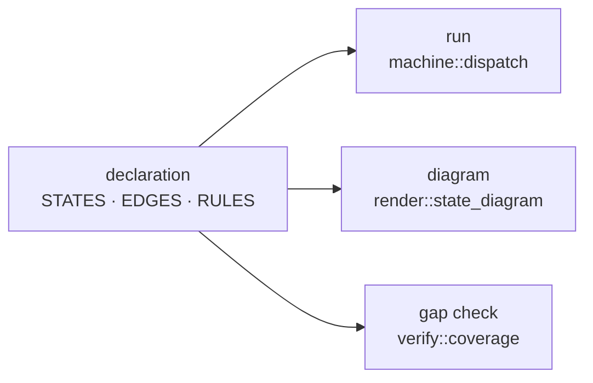

# declared

A declarative controller framework for Rust. You describe what a controller
reacts to and what it does about it as static data, and that one declaration
drives the runtime, the diagram, and the gap check.

[한국어 문서](README_KR.md) · [개발자 문서 (한국어)](docs/README.md)

## Purpose

Spread controller logic across `match` arms and "what happens when this event
arrives" can only be answered by reading the whole file. Meanwhile the diagram
someone drew for it slowly stops matching reality.

`declared` makes the table the source. The diagram and the checks are generated
from the exact data the executor runs, so there is no second copy to keep in
sync.



### Two layers

Two layers share one vocabulary (`Domain`); take whichever a controller needs.

- **`feature`** — when behavior does not depend on history. Declare the events it takes and the actions it emits.
- **`machine`** — when the same event means different things in different states. Declare a transition table.

Because they share a `Domain`, a stateless feature that later needs history
keeps its declaration and gains a `MachineSpec` beside it. A declaration file
imports one line: `use declared::prelude::*;`.

## Quick start

A two-state light switch:

```rust
use declared::machine;
use declared::prelude::*;

declared::tags! { enum Tag { Off, On } }
declared::events! {
    #[derive(Clone, Debug)]
    enum Event => Kind { Toggle }
}

/// Reactions to an event. Only these are handed the event.
#[derive(Copy, Clone, PartialEq, Eq, Debug)]
enum Action { Click }

/// Effects of being in a state, run whichever edge led there.
#[derive(Copy, Clone, PartialEq, Eq, Debug)]
enum StateAction { TurnOn, TurnOff }

struct World;
struct Light;

impl Domain for Light {
    type Event = Event;
    type EventKind = Kind;
    type World = World;
}

impl MachineSpec for Light {
    const NAME: &'static str = "Light";

    type Domain = Light;
    type Tag = Tag;
    type Action = Action;
    type StateAction = StateAction;

    const STATES: &'static [State<Light>] = STATES;
    const EDGES: &'static [Edge<Light>] = EDGES;
    const IGNORES: &'static [Ignore<Light>] = IGNORES;

    fn perform(action: Action, _ev: &Event, _world: &mut World) {
        match action {
            Action::Click => println!("click"),
        }
    }

    fn perform_state(action: StateAction, _world: &mut World) {
        match action {
            StateAction::TurnOn => println!("on"),
            StateAction::TurnOff => println!("off"),
        }
    }
}

static STATES: &[State<Light>] = &[
    State { tag: Tag::Off, entry: &[StateAction::TurnOff], exit: &[] },
    State { tag: Tag::On,  entry: &[StateAction::TurnOn],  exit: &[] },
];

static EDGES: &[Edge<Light>] = &[
    Edge { id: "TURN_ON",  from: Source::These(&[Tag::Off]), when: Kind::Toggle,
           check: declared::check!(), unknown: OnUnknown::Deny,
           emit: &[Action::Click], goto: Goto::To(Tag::On) },
    Edge { id: "TURN_OFF", from: Source::These(&[Tag::On]),  when: Kind::Toggle,
           check: declared::check!(), unknown: OnUnknown::Deny,
           emit: &[Action::Click], goto: Goto::To(Tag::Off) },
];

static IGNORES: &[Ignore<Light>] = &[];

fn main() {
    let mut world = World;
    // A machine resumes rather than starts: `Tag::Off` says the lamp is
    // already off, so `Off`'s entry action does not run here.
    let mut m = Machine::<Light>::new(Tag::Off);
    machine::dispatch(&mut m, &Event::Toggle, &mut world); // -> click, on
    machine::dispatch(&mut m, &Event::Toggle, &mut world); // -> click, off
}
```

Bigger examples:

- [`examples/door_lock`](examples/door_lock/main.rs) — four states, guard conditions, `Ignore` with wildcard sources
- [`examples/mirrors`](examples/mirrors/main.rs) — a controller mixing both layers: two stateless features next to one state machine

## What it buys you

- **The table is the running code**
  - `machine::dispatch` and `feature::dispatch` read the table you wrote.
  - There is no separate interpretation step to fall out of sync with it.

- **A forgotten case fails CI, not production**
  - `verify::coverage` walks every `(state × event)` pair and reports the ones with no edge and no `Ignore`.
  - Assert `is_clean()` in a test and the gap stops the build.

- **One definition per condition**
  - A guard is declared against the `Domain`, so "power is on" is one node the whole controller shares.
  - Node names are unique per domain, and `verify::duplicate_node_names` checks it across features and machines together.

- **Undecidable is not hidden**
  - Conditions evaluate to `True`/`False`/`Unknown` rather than `bool`.
  - The fail-open or fail-closed policy is named by `Edge::unknown` and shows up on the diagram instead of inside a guard function.

- **Effects are traceable**
  - `perform` is the only place the outside world is touched, so every effect a dispatch produced is a plain value you can log or assert on.
  - Every row carries an id (`Edge::id`, `Rule::id`), and both layers' `dispatch` returns the one that ran.

- **Effects belong to whoever emits them**
  - Each feature and each machine names its own action type, so every `perform` is exhaustive over exactly the effects its own file declares. Adding one is a compile error there and nowhere else.
  - Entry and exit run whichever edge led there, so they use a separate vocabulary, `StateAction`, and `perform_state` gets no event. An effect that needs one goes on an edge.

- **It is `no_std`**
  - Runs on `core` alone; dispatch and guard evaluation touch no heap.
  - `alloc` is needed only by `render` and `verify` — what reports on a controller rather than runs it.

## Tests

```sh
cargo test
cargo run --example door_lock          # checks examples/door_lock/door_lock.md
cargo run --example mirrors            # checks examples/mirrors/mirrors.md
```

Each example regenerates its document and compares it with the committed `.md`,
failing on drift — those files are `render`'s tests. After an intended change,
pass `-- --write` to regenerate.
