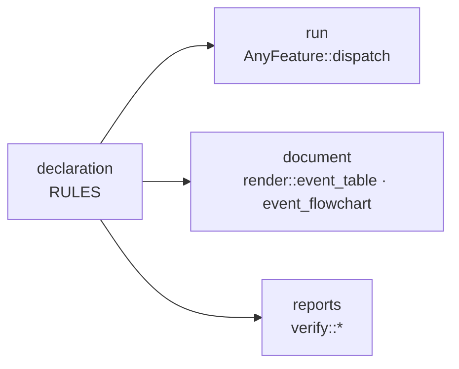

# declared

A declarative controller framework for Rust. You describe what a controller
reacts to and what it does about it as static data, and that one declaration
drives the runtime, the diagrams and the reports.

[한국어 문서](README_KR.md) · [개발자 문서 (한국어)](docs/README.md)

## Purpose

Spread controller logic across `match` arms and "what happens when this event
arrives" can only be answered by reading the whole file. Meanwhile the diagram
someone drew for it slowly stops matching reality.

`declared` makes the table the source. The diagrams and the checks are generated
from the exact data the executor runs, so there is no second copy to keep in
sync.



### One kind of table

A controller is a list of features, and a feature is a list of rules: the event
kinds it is considered for, the condition that has to hold, and what it emits.
That is the whole model.

A controller that keeps state keeps it in its `World`, where a guard reads it
and an action writes it — like everything else it keeps. There is no second
layer for it, and no second kind of row. A declaration file imports one line:
`use declared::prelude::*;`.

## Quick start

A two-state light switch:

```rust
use declared::feature::AnyFeature;
use declared::prelude::*;

declared::events! {
    #[derive(Clone, Debug)]
    enum Event => Kind { Toggle }
}

#[derive(Copy, Clone, PartialEq, Eq, Debug)]
enum Action { TurnOn, TurnOff }

#[derive(Default)]
struct World { lit: bool }

struct Light;

impl Domain for Light {
    type Event = Event;
    type EventKind = Kind;
    type World = World;
}

declared::cond_node!(Light, IsLit, |cx| Cond::from(cx.world.lit));

impl Feature for Light {
    type Domain = Light;
    type Action = Action;

    const NAME: &'static str = "Light";

    const RULES: &'static [Rule<Light, Action>] = &[
        Rule { id: "TURN_OFF", when: &[Kind::Toggle],
               check: declared::check!(IsLit), unknown: OnUnknown::Deny,
               emit: &[Action::TurnOff] },
        // No guard: the fallback, reached only when the row above did not match.
        Rule { id: "TURN_ON", when: &[Kind::Toggle],
               check: declared::check!(), unknown: OnUnknown::Deny,
               emit: &[Action::TurnOn] },
    ];

    fn perform(action: Action, _ev: &Event, world: &mut World) {
        match action {
            Action::TurnOn => { world.lit = true; println!("on") }
            Action::TurnOff => { world.lit = false; println!("off") }
        }
    }
}

fn main() {
    let mut world = World::default();
    Light.dispatch(&Event::Toggle, &mut world); // -> on
    Light.dispatch(&Event::Toggle, &mut world); // -> off
}
```

Bigger examples:

- [`examples/door_lock`](examples/door_lock/main.rs) — a four-position lock, the case where naming the position as a field of `World` has the most to prove
- [`examples/mirrors`](examples/mirrors/main.rs) — three features over one domain, and a signal the controller keeps without deciding on

## What it buys you

- **The table is the running code**
  - `AnyFeature::dispatch` reads the table you wrote.
  - There is no separate interpretation step to fall out of sync with it.

- **The document is written per signal**
  - `render::event_table` and `event_flowchart` take one event kind and gather every rule that reacts to it, across features.
  - A requirement reads "on X, if C, do A", so a section of it and one of these tables sit side by side.
  - Every arrow carries its rule's id and then its guard — the name states the intent, the guard states what it decides by, and a review is mostly checking that those agree.

- **One definition per condition**
  - A guard is declared against the `Domain`, so "power is on" is one node the whole controller shares.
  - Node names are unique per domain, and `verify::duplicate_node_names` checks it across every feature at once.

- **Undecidable is not hidden**
  - Conditions evaluate to `True`/`False`/`Unknown` rather than `bool`.
  - The fail-open or fail-closed policy is named by `Rule::unknown` and shows up in the table instead of inside a guard function.

- **Effects are traceable**
  - `perform` is the only place the outside world is touched, so every effect a dispatch produced is a plain value you can log or assert on.
  - Every row carries an id, and `dispatch` returns the one that ran.

- **Effects belong to whoever emits them**
  - Each feature names its own action type, so every `perform` is exhaustive over exactly the effects its own file declares. Adding one is a compile error there and nowhere else.

- **It is `no_std`**
  - Runs on `core` alone; dispatch and guard evaluation touch no heap.
  - `alloc` is needed only by `render` and `verify` — what reports on a controller rather than runs it.

## What it does not check

A rule table decides by conditions, and nothing here asks whether the rules on
one event cover every combination of them, or whether a rule is completely
shadowed by one above it. `Expr` stays a tree of named nodes, so it is
answerable; it is not answered yet. See
[docs/4](docs/4-verification.md#검사가-잡지-못하는-것).

## Tests

```sh
cargo test
cargo run --example door_lock          # checks examples/door_lock/door_lock.md
cargo run --example mirrors            # checks examples/mirrors/mirrors.md
```

Each example regenerates its document and compares it with the committed `.md`,
failing on drift — those files are `render`'s tests. After an intended change,
pass `-- --write` to regenerate.
