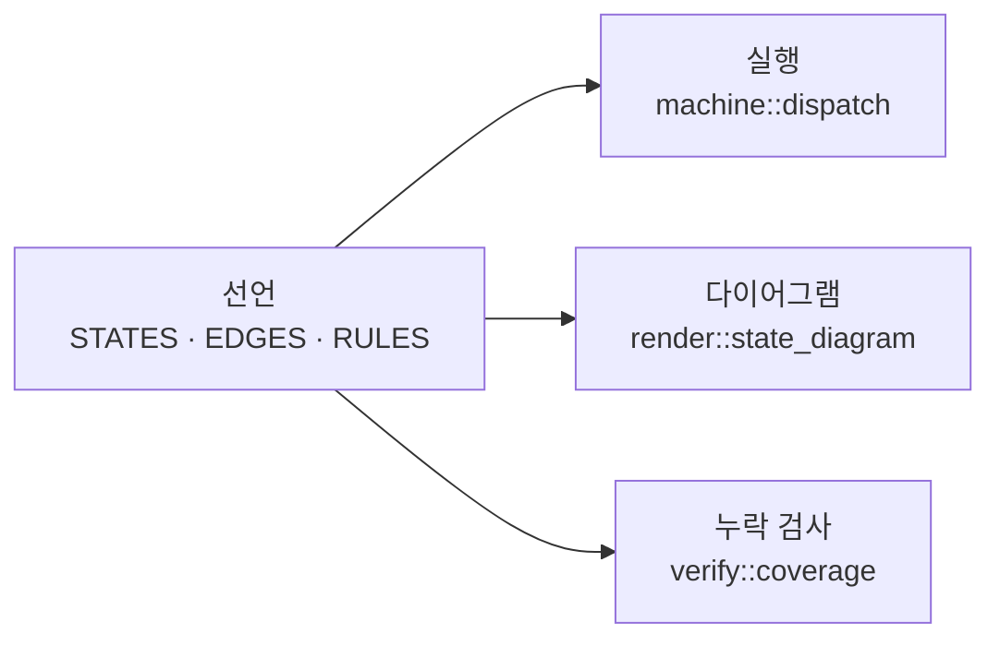

# declared

선언형 컨트롤러 프레임워크입니다. 컨트롤러가 무엇에 반응하고 무엇을 하는지를
정적 데이터로 선언하면, 그 선언 하나가 실행기와 다이어그램과 누락 검사를
만들어냅니다.

[English README](README.md)

## 목적

로직이 `match` 문에 흩어지면 "이 이벤트가 오면 무슨 일이 일어나는가"를 알기
위해 코드를 전부 읽어야 합니다. 그리고 누군가 그려둔 다이어그램은 시간이
지나면서 실제와 어긋납니다.

`declared`는 표를 소스로 둡니다. 다이어그램도 검사도 실행기가 읽는 바로 그
데이터에서 나오므로, 동기화할 사본이 애초에 없습니다.



### 두 개의 층

같은 어휘(`Domain`)를 공유하는 두 층이 있고, 필요한 쪽만 골라 씁니다.

- **`feature`** — 동작이 과거에 의존하지 않을 때. 받는 이벤트와 내는 액션을 선언합니다.
- **`machine`** — 같은 이벤트가 상태에 따라 다른 뜻을 가질 때. 전이 표를 선언합니다.

`Domain`을 공유하므로, 상태 없이 시작한 기능이 나중에 이력이 필요해져도
선언은 그대로 두고 `MachineSpec`만 옆에 추가하면 됩니다. 선언 파일이 가져올
것은 `use declared::prelude::*;` 한 줄입니다.

## 빠른 시작

전등을 껐다 켰다 하는 2상태 예제입니다.

```rust
use declared::machine;
use declared::prelude::*;

declared::tags! { enum Tag { Off, On } }
declared::events! {
    #[derive(Clone, Debug)]
    enum Event => Kind { Toggle }
}

/// 이벤트에 대한 반응. 이벤트를 건네받는 것은 이쪽뿐입니다.
#[derive(Copy, Clone, PartialEq, Eq, Debug)]
enum Action { Click }

/// 상태에 있다는 사실에서 나오는 효과. 어느 엣지로 들어왔든 실행됩니다.
#[derive(Copy, Clone, PartialEq, Eq, Debug)]
enum StateAction { TurnOn, TurnOff }

struct World;
struct Light;

impl Domain for Light {
    type Event = Event;
    type EventKind = Kind;
    type World = World;
}

impl MachineSpec for Light {
    const NAME: &'static str = "Light";

    type Domain = Light;
    type Tag = Tag;
    type Action = Action;
    type StateAction = StateAction;

    const STATES: &'static [State<Light>] = STATES;
    const EDGES: &'static [Edge<Light>] = EDGES;
    const IGNORES: &'static [Ignore<Light>] = IGNORES;

    fn perform(action: Action, _ev: &Event, _world: &mut World) {
        match action {
            Action::Click => println!("click"),
        }
    }

    fn perform_state(action: StateAction, _world: &mut World) {
        match action {
            StateAction::TurnOn => println!("on"),
            StateAction::TurnOff => println!("off"),
        }
    }
}

static STATES: &[State<Light>] = &[
    State { tag: Tag::Off, entry: &[StateAction::TurnOff], exit: &[] },
    State { tag: Tag::On,  entry: &[StateAction::TurnOn],  exit: &[] },
];

static EDGES: &[Edge<Light>] = &[
    Edge { id: "TURN_ON",  from: Source::These(&[Tag::Off]), when: Kind::Toggle,
           check: declared::check!(), unknown: OnUnknown::Deny,
           emit: &[Action::Click], goto: Goto::To(Tag::On) },
    Edge { id: "TURN_OFF", from: Source::These(&[Tag::On]),  when: Kind::Toggle,
           check: declared::check!(), unknown: OnUnknown::Deny,
           emit: &[Action::Click], goto: Goto::To(Tag::Off) },
];

static IGNORES: &[Ignore<Light>] = &[];

fn main() {
    let mut world = World;
    let mut m = Machine::<Light>::new(Tag::Off);
    machine::dispatch(&mut m, &Event::Toggle, &mut world); // -> click, on
    machine::dispatch(&mut m, &Event::Toggle, &mut world); // -> click, off
}
```

더 큰 예제입니다.

- [`examples/door_lock`](examples/door_lock/main.rs) — 상태 4개, 조건 가드, 와일드카드 `Ignore`
- [`examples/mirrors`](examples/mirrors/main.rs) — 두 층을 섞은 컨트롤러: 상태 없는 기능 둘과 상태 기계 하나

## 이점

- **표가 곧 실행 코드입니다**
  - `machine::dispatch`와 `feature::dispatch`가 작성한 표를 그대로 읽습니다.
  - 표와 어긋날 수 있는 별도의 해석 단계가 없습니다.

- **빠뜨린 조합은 CI에서 걸립니다**
  - `verify::coverage`가 `(상태 × 이벤트)`를 전수 순회해 엣지도 `Ignore`도 없는 것을 보고합니다.
  - 테스트에서 `is_clean()`을 assert 해 두면 운영이 아니라 CI에서 멈춥니다.

- **조건은 정의가 하나입니다**
  - 가드는 머신이나 기능이 아니라 `Domain`에 대해 선언합니다. "전원이 켜져 있다"는 컨트롤러 전체가 공유하는 노드 하나입니다.
  - 노드 이름은 도메인 안에서 고유하며, `verify::duplicate_node_names`가 확인합니다.

- **판정 불가를 숨기지 않습니다**
  - 조건은 `bool`이 아니라 `True`/`False`/`Unknown` 세 값입니다.
  - 불가일 때의 정책은 `Edge::unknown`에 적히고, 가드 함수 안이 아니라 다이어그램에 드러납니다.

- **효과를 추적할 수 있습니다**
  - 바깥 세상은 `perform`에서만 바뀝니다. 한 번의 dispatch가 만든 효과는 전부 로그로 남기거나 검증할 수 있는 값입니다.
  - 모든 행이 id를 갖고(`Edge::id`, `Rule::id`), 양쪽 층의 `dispatch`가 실행된 행의 id를 돌려줍니다.

- **효과의 주인은 그것을 낸 쪽입니다**
  - 기능과 머신이 각자 액션 타입을 가지므로, 모든 `perform`은 자기 파일이 선언한 효과에 대해서만 exhaustive합니다. 액션을 추가하면 그 파일에서만 컴파일이 깨집니다.
  - 진입·이탈은 어느 엣지로 들어왔든 실행되므로 `StateAction`이라는 별도 어휘를 쓰고, `perform_state`는 이벤트를 받지 않습니다. 이벤트가 필요한 효과는 엣지로 갑니다.

- **`no_std`입니다**
  - `core`만으로 돌아가며, dispatch와 가드 판정은 힙을 쓰지 않습니다.
  - `alloc`은 `render`와 `verify` — 컨트롤러를 실행하는 쪽이 아니라 보고하는 쪽 — 에만 필요합니다.

## 테스트

```sh
cargo test
cargo run --example door_lock          # examples/door_lock/door_lock.md 검사
cargo run --example mirrors            # examples/mirrors/mirrors.md 검사
```

각 예제는 문서를 다시 만들어 커밋된 `.md`와 대조하고, 어긋나면 실패합니다.
그 파일들이 `render`의 테스트입니다. 의도한 변경 뒤에는 `-- --write`로
재생성합니다.
