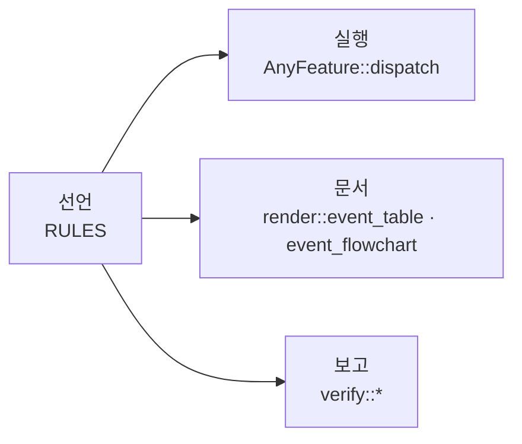

# declared

선언형 컨트롤러 프레임워크입니다. 컨트롤러가 무엇에 반응하고 무엇을 하는지를
정적 데이터로 선언하면, 그 선언 하나가 실행기와 다이어그램과 보고를
만들어냅니다.

[English README](README.md) · [개발자 문서](docs/README.md)

## 목적

로직이 `match` 문에 흩어지면 "이 이벤트가 오면 무슨 일이 일어나는가"를 알기
위해 코드를 전부 읽어야 합니다. 그리고 누군가 그려둔 다이어그램은 시간이
지나면서 실제와 어긋납니다.

`declared`는 표를 소스로 둡니다. 다이어그램도 검사도 실행기가 읽는 바로 그
데이터에서 나오므로, 동기화할 사본이 애초에 없습니다.



### 표는 한 종류입니다

컨트롤러는 기능의 목록이고, 기능은 규칙의 목록입니다. 규칙은 자기가 고려되는
이벤트 종류, 성립해야 하는 조건, 그리고 내보낼 액션으로 이루어집니다. 모델은
이게 전부입니다.

상태를 보관하는 컨트롤러는 그것을 `World`에 둡니다. 가드가 읽고 액션이 쓰며,
컨트롤러가 보관하는 다른 모든 것과 같습니다. 이를 위한 별도의 층도, 별도의
행 종류도 없습니다. 선언 파일이 가져올 것은 `use declared::prelude::*;`
한 줄입니다.

## 빠른 시작

전등을 껐다 켰다 하는 예제입니다.

```rust
use declared::feature::AnyFeature;
use declared::prelude::*;

declared::events! {
    #[derive(Clone, Debug)]
    enum Event => Kind { Toggle }
}

#[derive(Copy, Clone, PartialEq, Eq, Debug)]
enum Action { TurnOn, TurnOff }

#[derive(Default)]
struct World { lit: bool }

struct Light;

impl Domain for Light {
    type Event = Event;
    type EventKind = Kind;
    type World = World;
}

declared::cond_node!(Light, IsLit, |cx| Cond::from(cx.world.lit));

impl Feature for Light {
    type Domain = Light;
    type Action = Action;

    const NAME: &'static str = "Light";

    const RULES: &'static [Rule<Light, Action>] = &[
        Rule { id: "TURN_OFF", when: &[Kind::Toggle],
               check: declared::check!(IsLit), unknown: OnUnknown::Deny,
               emit: &[Action::TurnOff] },
        // 가드 없음: 위 규칙이 걸리지 않았을 때만 도달하는 fallback.
        Rule { id: "TURN_ON", when: &[Kind::Toggle],
               check: declared::check!(), unknown: OnUnknown::Deny,
               emit: &[Action::TurnOn] },
    ];

    fn perform(action: Action, _ev: &Event, world: &mut World) {
        match action {
            Action::TurnOn => { world.lit = true; println!("on") }
            Action::TurnOff => { world.lit = false; println!("off") }
        }
    }
}

fn main() {
    let mut world = World::default();
    Light.dispatch(&Event::Toggle, &mut world); // -> on
    Light.dispatch(&Event::Toggle, &mut world); // -> off
}
```

더 큰 예제입니다.

- [`examples/door_lock`](examples/door_lock/main.rs) — 위치가 넷인 잠금장치. 위치를 `World`의 필드로 두는 방식이 가장 불리한 조건에서 어떻게 읽히는지 보는 예제
- [`examples/mirrors`](examples/mirrors/main.rs) — 한 도메인 위의 기능 셋, 그리고 판단 없이 보관만 하는 신호

## 이점

- **표가 곧 실행 코드입니다**
  - `AnyFeature::dispatch`가 작성한 표를 그대로 읽습니다.
  - 표와 어긋날 수 있는 별도의 해석 단계가 없습니다.

- **문서가 신호 단위로 나옵니다**
  - `render::event_table`과 `event_flowchart`는 이벤트 종류 하나를 받아, 기능을 가로질러 거기 걸리는 규칙을 전부 모읍니다.
  - 사양은 "무엇이 왔을 때 어떤 조건이면 무엇을 한다"로 쓰이므로, 사양 한 절과 이 표 하나를 나란히 놓을 수 있습니다.
  - 화살표마다 규칙의 id가 먼저, 그다음 가드가 붙습니다. 이름이 의도를 말하고 가드가 판단 근거를 말하니, 리뷰는 대개 그 둘이 일치하는지 보는 일입니다.

- **조건은 정의가 하나입니다**
  - 가드는 기능이 아니라 `Domain`에 대해 선언합니다. "전원이 켜져 있다"는 컨트롤러 전체가 공유하는 노드 하나입니다.
  - 노드 이름은 도메인 안에서 고유하며, `verify::duplicate_node_names`가 기능 전체를 한 번에 훑어 확인합니다.

- **판정 불가를 숨기지 않습니다**
  - 조건은 `bool`이 아니라 `True`/`False`/`Unknown` 세 값입니다.
  - 불가일 때의 정책은 `Rule::unknown`에 적히고, 가드 함수 안이 아니라 표에 드러납니다.

- **효과를 추적할 수 있습니다**
  - 바깥 세상은 `perform`에서만 바뀝니다. 한 번의 dispatch가 만든 효과는 전부 로그로 남기거나 검증할 수 있는 값입니다.
  - 모든 행이 id를 갖고, `dispatch`가 실행된 행의 id를 돌려줍니다.

- **효과의 주인은 그것을 낸 쪽입니다**
  - 기능마다 액션 타입이 따로이므로, 모든 `perform`은 자기 파일이 선언한 효과에 대해서만 exhaustive합니다. 액션을 추가하면 그 파일에서만 컴파일이 깨집니다.

- **`no_std`입니다**
  - `core`만으로 돌아가며, dispatch와 가드 판정은 힙을 쓰지 않습니다.
  - `alloc`은 `render`와 `verify` — 컨트롤러를 실행하는 쪽이 아니라 보고하는 쪽 — 에만 필요합니다.

## 검사하지 못하는 것

규칙 표는 조건으로 판단하는데, 한 이벤트에 걸린 규칙들이 조건의 모든 조합에서
답을 내는지, 어느 규칙이 앞 규칙에 완전히 가려져 있는지는 아무도 묻지
않습니다. `Expr`가 이름 붙은 노드의 트리로 남아 있으므로 답할 수는 있지만,
아직 답하지 않았습니다. [docs/4](docs/4-verification.md#검사가-잡지-못하는-것)를
보십시오.

## 테스트

```sh
cargo test
cargo run --example door_lock          # examples/door_lock/door_lock.md 검사
cargo run --example mirrors            # examples/mirrors/mirrors.md 검사
```

각 예제는 문서를 다시 만들어 커밋된 `.md`와 대조하고, 어긋나면 실패합니다.
그 파일들이 `render`의 테스트입니다. 의도한 변경 뒤에는 `-- --write`로
재생성합니다.
