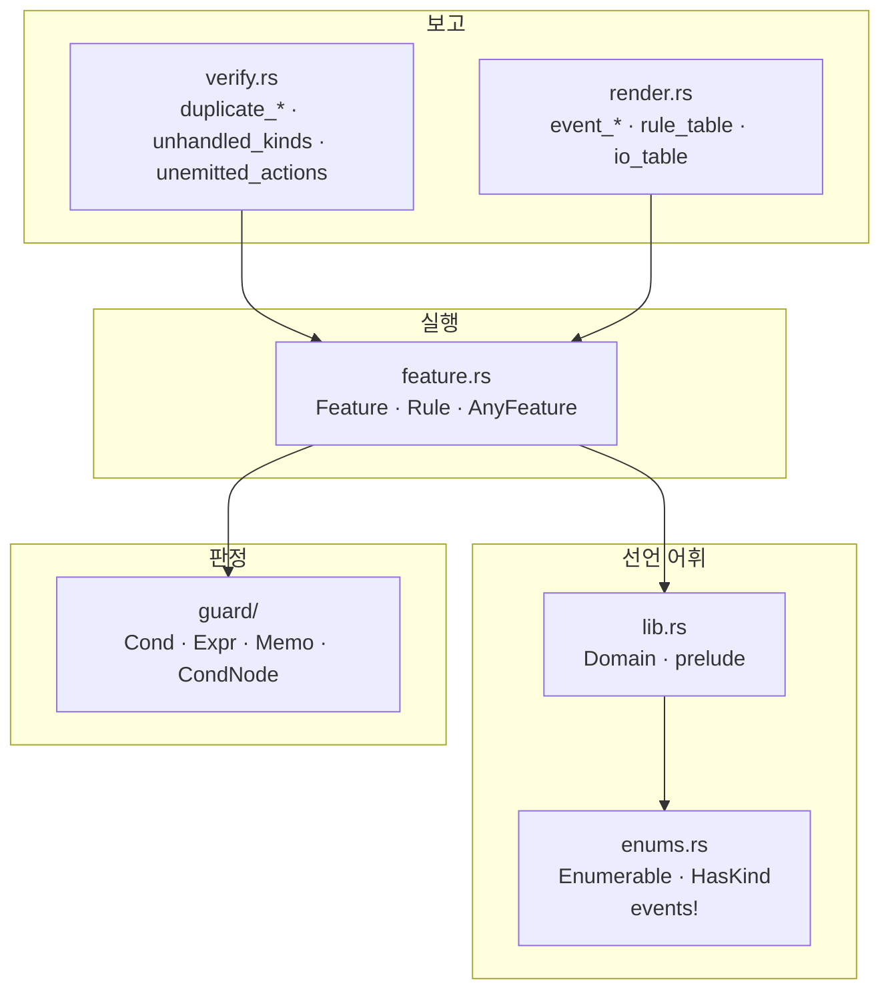
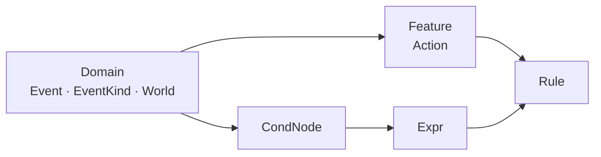

# 1. 구조

파일이 어떻게 나뉘어 있고, 무엇이 무엇을 아는지에 대한 문서입니다.

## 의존 방향

화살표는 "이쪽이 저쪽을 안다"는 뜻입니다. 반대 방향은 없습니다.

핵심은 두 가지입니다.

- **`guard`는 기능을 모릅니다.** `Domain`에 대해서만 선언되므로 같은 가드
  노드가 어느 기능의 `Rule`이든 받칩니다.
- **`verify`와 `render`는 실행에 관여하지 않습니다.** 표를 읽기만 하며,
  실행 경로는 이 둘을 부르지 않습니다.

## 파일별 역할

| 파일 | 사는 것 | 성격 |
|---|---|---|
| `lib.rs` | `Domain`, 타입 별칭, `prelude` | 선언 어휘 |
| `enums.rs` | `Enumerable`, `HasKind`, `events!` | 값 목록을 컴파일 타임에 확보 |
| `guard.rs` | `OnUnknown` | 판정 불가일 때의 정책 |
| `guard/cond.rs` | `Cond` 3값 논리 | 판정 결과 |
| `guard/node.rs` | `CondNode`, `Cx`, `Memo`, `Expr`, `cond_node!`, `check!` | 가드 노드와 트리 |
| `feature.rs` | `Feature`, `Rule`, `AnyFeature`, `RuleRow` | 규칙 표와 실행기 |
| `verify.rs` | 검사 전부 | 표를 읽고 결함을 보고 |
| `render.rs` | 다이어그램·표 생성 | 표를 읽고 문서를 생성 |

## 타입이 서로를 부르는 방식

한 컨트롤러의 타입 관계입니다.

- `Domain`은 **공유되는 것만** 담습니다. 이벤트와 세상입니다.
- 액션은 공유되지 않습니다. `Feature::Action`은 그 기능의 것이라,
  `perform`이 자기 파일의 효과에 대해서만 exhaustive해집니다.
- `Expr`는 `Domain`에만 매개되므로 어느 기능의 `Rule`에든 그대로 꽂힙니다.

## 표는 한 종류입니다

상태를 따로 두는 층은 없습니다. 이름 붙은 구성(잠김/열림, 접힘/펼침)을 두는
컨트롤러는 그것을 `World`의 필드로 두고, **가드가 읽고 액션이 씁니다.** 다른
모든 것과 같은 방식입니다.

| | |
|---|---|
| 선언 | `const RULES` |
| 런타임 인스턴스 | 없음 — 기능은 표 그 자체 |
| 목록으로 묶기 | `&[&dyn AnyFeature<D>]` — `const` 가능 |
| "지금 어디" | `World`의 필드, 가드로 읽음 |

기능이 인스턴스를 갖지 않으므로 라우터는 `const` 목록 하나를 순회하는 함수이고,
문서가 그리는 목록과 실제로 도는 목록이 어긋날 수가 없습니다.

이 선택의 대가는 [4. 검사](4-verification.md)에 적혀 있습니다. 전이표가 주던
`(상태 × 이벤트)` 전수 검사가 함께 사라집니다.

## `no_std` 경계

크레이트 전체가 `no_std`입니다. `alloc`이 필요한 범위는 다음과 같습니다.

| 부분 | 힙 사용 |
|---|---|
| `dispatch`, 가드 판정, `Memo`, 표 조회 | 없음 |
| `verify` — 결함 목록을 만듦 | `Vec`, `String` |
| `render` — 문서 문자열을 만듦 | `Vec`, `String` |
| `AnyFeature::rows`, `handles`, `emits` 등 보고용 | `Vec`, `String` |

즉 **컨트롤러를 실행하는 쪽은 힙을 쓰지 않고, 보고하는 쪽만 씁니다.**
`extern crate alloc`이 무조건이므로 링크 시 전역 할당자는 필요합니다.
