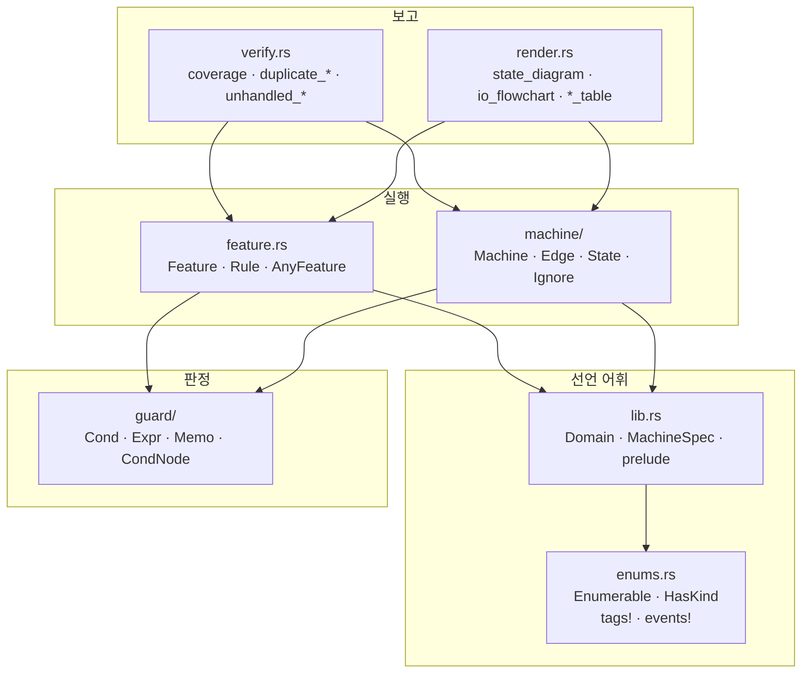
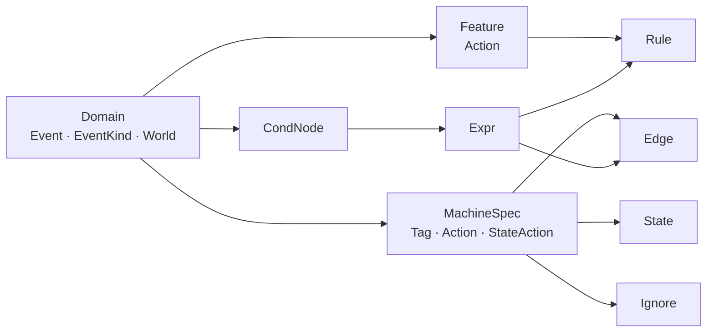

# 1. 구조

파일이 어떻게 나뉘어 있고, 무엇이 무엇을 아는지에 대한 문서입니다.

## 의존 방향

화살표는 "이쪽이 저쪽을 안다"는 뜻입니다. 반대 방향은 없습니다.

핵심은 두 가지입니다.

- **`guard`는 어느 층도 모릅니다.** `Domain`에 대해서만 선언되므로 같은 가드
  노드가 `Edge`와 `Rule` 양쪽을 받칩니다.
- **`verify`와 `render`는 실행에 관여하지 않습니다.** 표를 읽기만 하며,
  실행 경로는 이 둘을 부르지 않습니다. 예외는 `Machine::new`가 디버그
  빌드에서 `verify::coverage`를 한 번 부르는 것뿐입니다.

## 파일별 역할

| 파일 | 사는 것 | 성격 |
|---|---|---|
| `lib.rs` | `Domain`, `MachineSpec`, `NoAction`, 타입 별칭, `prelude` | 선언 어휘 |
| `enums.rs` | `Enumerable`, `HasKind`, `tags!`, `events!` | 값 목록을 컴파일 타임에 확보 |
| `guard.rs` | `OnUnknown` | 판정 불가일 때의 정책 |
| `guard/cond.rs` | `Cond` 3값 논리 | 판정 결과 |
| `guard/node.rs` | `CondNode`, `Cx`, `Memo`, `Expr`, `cond_node!`, `check!` | 가드 노드와 트리 |
| `feature.rs` | `Feature`, `Rule`, `AnyFeature`, `RuleRow` | 상태 없는 층 |
| `machine.rs` | `Machine`, `dispatch`, `Taken` | 상태 있는 층의 실행기 |
| `machine/state.rs` | `State` | 상태 한 줄 |
| `machine/edge.rs` | `Edge`, `Source`, `Goto`, `Ignore` | 전이 표의 행 |
| `verify.rs` | 검사 전부 | 표를 읽고 결함을 보고 |
| `render.rs` | 다이어그램·표 생성 | 표를 읽고 문서를 생성 |

## 타입이 서로를 부르는 방식

한 컨트롤러의 타입 관계입니다.

- `Domain`은 **공유되는 것만** 담습니다. 이벤트와 세상입니다.
- 액션은 공유되지 않습니다. `Feature::Action`과 `MachineSpec::Action`은
  각자의 것이라, `perform`이 자기 파일의 효과에 대해서만 exhaustive해집니다.
- `Expr`는 `Domain`에만 매개되므로 `Rule`과 `Edge` 양쪽에 그대로 꽂힙니다.

## 상태가 있는 것과 없는 것

이 구분이 API 모양을 결정합니다.

| | 기능(`Feature`) | 머신(`MachineSpec`) |
|---|---|---|
| 선언 | `const RULES` | `const STATES` · `EDGES` · `IGNORES` |
| 런타임 인스턴스 | 없음 | `Machine<M>` (현재 태그를 보관) |
| 목록으로 묶기 | `&[&dyn AnyFeature<D>]` — `const` 가능 | 구조체 필드로 보관 |
| 생성 시점 검증 | 없음 | `Machine::new`가 표를 검사 |

기능은 표 그 자체이므로 인스턴스가 필요 없습니다. 머신은 "지금 어디"를
들고 있어야 하므로 인스턴스가 필요하고, 그래서 생성 시점에 표를 검사할
기회가 생깁니다.

## `no_std` 경계

크레이트 전체가 `no_std`입니다. `alloc`이 필요한 범위는 다음과 같습니다.

| 부분 | 힙 사용 |
|---|---|
| `dispatch`, 가드 판정, `Memo`, 표 조회 | 없음 |
| `verify` — 결함 목록을 만듦 | `Vec`, `String` |
| `render` — 문서 문자열을 만듦 | `Vec`, `String` |
| `Source::expand`, `AnyFeature::rows` 등 보고용 | `Vec`, `String` |

즉 **컨트롤러를 실행하는 쪽은 힙을 쓰지 않고, 보고하는 쪽만 씁니다.**
`extern crate alloc`이 무조건이므로 링크 시 전역 할당자는 필요합니다.
