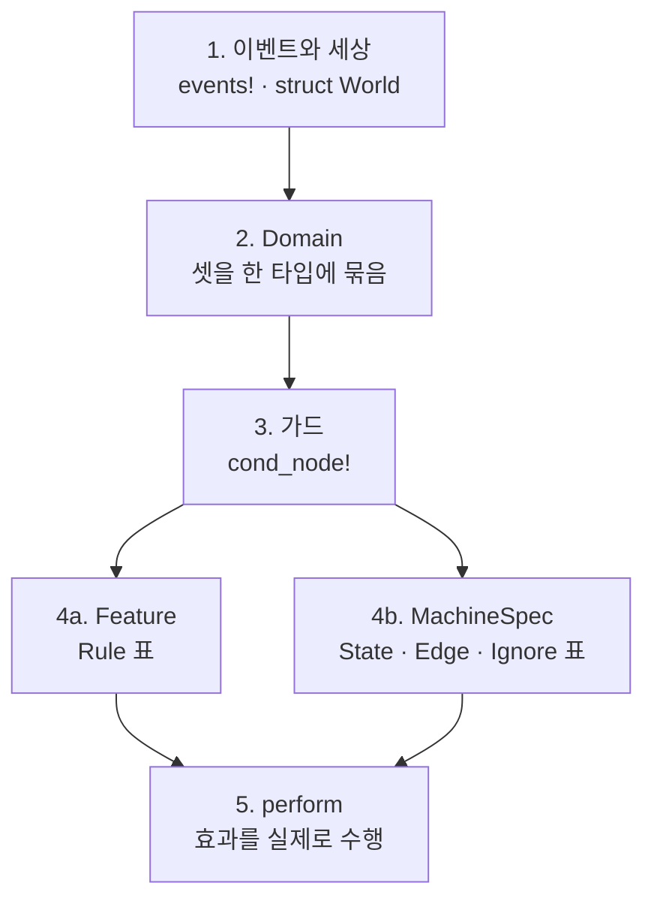

# 2. 선언

컨트롤러 하나를 이루는 선언들입니다. 순서대로 쌓으면 그대로 동작하는
컨트롤러가 됩니다.

## 쌓는 순서



## 1. 이벤트와 세상

`events!`는 네 가지를 한 번에 만듭니다.

```rust
declared::events! {
    #[derive(Clone, Debug)]
    enum Event => Kind {
        EnterCode(u32),
        Timeout,
    }
}
```

| 생성물 | 쓰임 |
|---|---|
| `enum Event` | 페이로드를 담은 실제 이벤트 |
| `enum Kind` | 페이로드 없는 종류. 표가 매칭하는 대상 |
| `impl HasKind for Event` | `ev.kind()` |
| `impl Enumerable for Kind` | `Kind::ALL` — 전수 검사가 순회할 목록 |

- 여러 변형을 한 종류로 묶고 싶으면 `HasKind`를 손으로 구현합니다.
- 외부 크레이트의 이벤트 타입은 고아 규칙 때문에 직접 구현할 수 없으니
  뉴타입으로 감쌉니다.

상태 태그는 `tags!`로 만듭니다. `Enumerable`이 같이 붙습니다.

```rust
declared::tags! { enum Tag { Locked, Unlocked } }
```

## 2. Domain

컨트롤러의 부분들이 **공유하는 것만** 담습니다.

```rust
impl Domain for Door {
    type Event = Event;
    type EventKind = Kind;
    type World = World;
}
```

액션은 여기 없습니다. 효과의 주인은 그것을 내는 쪽이라, 액션 타입은
`Feature::Action`과 `MachineSpec::Action`이 각자 이름 짓습니다.

`all_kinds()`를 재정의하면 전수 검사가 훑는 범위를 좁힐 수 있습니다.
검사 범위만 좁아지고 실행은 여전히 모든 종류를 처리합니다.

## 3. 가드

```rust
declared::cond_node!(Door, CodeMatches, |cx| Cond::from(
    matches!(cx.event, Event::EnterCode(c) if *c == cx.world.correct_code)
));
```

- `cx.event`로 이벤트를, `cx.world`로 세상을 **읽기만** 합니다.
- 노드 이름은 `cond_node!`에 준 식별자에서 나옵니다.
  **도메인 안에서 고유해야 합니다** — [4장](4-verification.md)을 보십시오.
- 한 모듈에 모아 선언하면 컴파일러가 중복을 막아 줍니다.

`check!`로 엮습니다.

| 쓰는 법 | 결과 |
|---|---|
| `check!()` | 항상 참 |
| `check!(A)` | `A` |
| `check!(!A)` | `A`의 부정 |
| `check!(A && !B && C)` | `&&` 체인 |

`||`는 일부러 없습니다. 한 행을 탈 이유가 둘이면 행도 둘이고, 그래야
각 이유가 자기 id를 갖습니다. 정말로 하나의 조건인 논리합은
`Expr::Or`를 직접 씁니다.

## 4a. Feature — 상태 없는 층

```rust
impl Feature for Heating {
    type Domain = Mirrors;
    type Action = Action;

    const NAME: &'static str = "Heating";
    const RULES: &'static [Rule<Mirrors, Action>] = &[ /* ... */ ];

    fn perform(action: Action, ev: &Event, world: &mut World) { /* ... */ }
}
```

`Rule`의 필드입니다.

| 필드 | 뜻 |
|---|---|
| `id` | 이 규칙의 안정된 이름. **컨트롤러 전체에서 고유해야 합니다** |
| `when` | 이 규칙이 고려되는 이벤트 종류들. 여럿 가능 |
| `check` | 성립해야 하는 조건 |
| `unknown` | 조건이 `Unknown`일 때 취할지 말지 |
| `emit` | 통과했을 때 실행할 액션들. 선언 순서대로 |

- **선언 순서가 우선순위입니다.** 먼저 통과한 규칙 하나만 실행됩니다.
- 가드 없는 규칙(`check!()`)은 항상 통과하므로 마지막 줄의 fallback이 됩니다.
- `id`는 `dispatch`가 돌려주는 값이자 문서 표에 찍히는 이름입니다.

## 4b. MachineSpec — 상태 있는 층

```rust
impl MachineSpec for Door {
    const NAME: &'static str = "Door";

    type Domain = Door;
    type Tag = Tag;
    type Action = Action;
    type StateAction = StateAction;

    const STATES: &'static [State<Door>] = STATES;
    const EDGES: &'static [Edge<Door>] = EDGES;
    const IGNORES: &'static [Ignore<Door>] = IGNORES;

    fn perform(action: Action, ev: &Event, world: &mut World) { /* ... */ }
    fn perform_state(action: StateAction, world: &mut World) { /* ... */ }
}
```

### State

| 필드 | 뜻 |
|---|---|
| `tag` | 상태 이름 |
| `entry` | 이 상태에 **들어올 때** 실행할 `StateAction`들 |
| `exit` | 이 상태에서 **나갈 때** 실행할 `StateAction`들 |

### Edge

| 필드 | 뜻 |
|---|---|
| `id` | 이 전이의 안정된 이름. 표를 재배열해도 살아남아야 합니다 |
| `from` | 출발 상태 집합 (`These` / `AnyExcept` / `Any`) |
| `when` | 이 전이가 반응하는 이벤트 종류 **하나** |
| `check` | 성립해야 하는 조건 |
| `unknown` | 조건이 `Unknown`일 때의 정책 |
| `emit` | 이 전이가 실행할 `Action`들 |
| `goto` | `To(tag)`로 이동, 또는 `Internal`로 제자리 |

`Rule::when`은 복수인데 `Edge::when`은 단수입니다. `id` 하나가 전이 하나를
가리켜야 하기 때문입니다.

### Ignore

| 필드 | 뜻 |
|---|---|
| `from` | 대상 상태 집합 |
| `when` | 대상 이벤트 종류들. 여럿 가능 |
| `why` | 왜 일부러 처리하지 않는지 |

`why` 하나가 여러 조합을 정당화하므로 `when`이 복수입니다.
`Ignore`는 **바닥**이지 fallback이 아닙니다. 같은 조합에 `Edge`가 하나라도
있으면 검사가 모순으로 보고합니다.

## 5. 두 종류의 효과

| | `Action` | `StateAction` |
|---|---|---|
| 어디에 적히나 | `Edge::emit`, `Rule::emit` | `State::entry`, `State::exit` |
| 수행 함수 | `perform(action, ev, world)` | `perform_state(action, world)` |
| 이벤트를 보나 | **본다** | **못 본다** |
| 누구의 것인가 | 기능 또는 머신 | 머신만 |

진입·이탈은 어느 전이로 들어왔든 실행되므로, 원인이 된 이벤트를 특정할 수
없습니다. 그래서 어휘를 나눠 두고 `perform_state`에 이벤트를 주지 않습니다.
이벤트가 필요한 효과는 전이 쪽으로 보내면 됩니다.

효과가 아예 없는 쪽에는 `NoAction`을 씁니다. `perform`이 `match action {}`이
되어 틀릴 수도, 빠뜨릴 수도 없습니다.
