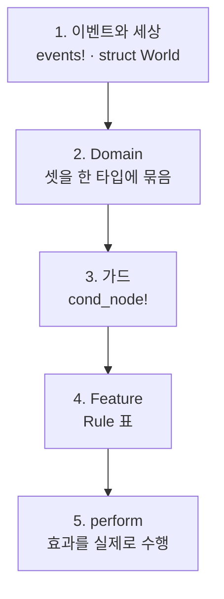

# 2. 선언

컨트롤러 하나를 이루는 선언들입니다. 순서대로 쌓으면 그대로 동작하는
컨트롤러가 됩니다.

## 쌓는 순서



## 1. 이벤트와 세상

`events!`는 네 가지를 한 번에 만듭니다.

```rust
declared::events! {
    #[derive(Clone, Debug)]
    enum Event => Kind {
        EnterCode(u32),
        Timeout,
    }
}
```

| 생성물 | 쓰임 |
|---|---|
| `enum Event` | 페이로드를 담은 실제 이벤트 |
| `enum Kind` | 페이로드 없는 종류. 표가 매칭하는 대상 |
| `impl HasKind for Event` | `ev.kind()` |
| `impl Enumerable for Kind` | `Kind::ALL` — 보고가 순회할 목록 |

- 여러 변형을 한 종류로 묶고 싶으면 `HasKind`를 손으로 구현합니다.
- 외부 크레이트의 이벤트 타입은 고아 규칙 때문에 직접 구현할 수 없으니
  뉴타입으로 감쌉니다.

`World`에는 컨트롤러가 보관하는 것이 전부 들어갑니다. 이름 붙은 구성(잠김/열림
같은 것)도 여기 필드 하나입니다. 상태를 위한 별도의 선언은 없습니다.

## 2. Domain

컨트롤러의 부분들이 **공유하는 것만** 담습니다.

```rust
impl Domain for Door {
    type Event = Event;
    type EventKind = Kind;
    type World = World;
}
```

액션은 여기 없습니다. 효과의 주인은 그것을 내는 쪽이라, 액션 타입은
기능마다 `Feature::Action`이 이름 짓습니다.

`all_kinds()`를 재정의하면 보고가 훑는 범위를 좁힐 수 있습니다.
보고 범위만 좁아지고 실행은 여전히 모든 종류를 처리합니다.

## 3. 가드

```rust
declared::cond_node!(Door, CodeMatches, |cx| Cond::from(
    matches!(cx.event, Event::EnterCode(c) if *c == cx.world.correct_code)
));
```

- `cx.event`로 이벤트를, `cx.world`로 세상을 **읽기만** 합니다.
- 노드 이름은 `cond_node!`에 준 식별자에서 나옵니다.
  **도메인 안에서 고유해야 합니다** — [4장](4-verification.md)을 보십시오.
- 한 모듈에 모아 선언하면 컴파일러가 중복을 막아 줍니다.

`check!`로 엮습니다.

| 쓰는 법 | 결과 |
|---|---|
| `check!()` | 항상 참 |
| `check!(A)` | `A` |
| `check!(!A)` | `A`의 부정 |
| `check!(A && !B && C)` | `&&` 체인 |

`||`는 일부러 없습니다. 한 행을 탈 이유가 둘이면 행도 둘이고, 그래야
각 이유가 자기 id를 갖습니다. 정말로 하나의 조건인 논리합은
`Expr::Or`를 직접 씁니다.

## 4. Feature

```rust
impl Feature for Heating {
    type Domain = Mirrors;
    type Action = Action;

    const NAME: &'static str = "Heating";
    const RULES: &'static [Rule<Mirrors, Action>] = &[ /* ... */ ];

    fn perform(action: Action, ev: &Event, world: &mut World) { /* ... */ }
}
```

`Rule`의 필드입니다.

| 필드 | 뜻 |
|---|---|
| `id` | 이 규칙의 안정된 이름. **컨트롤러 전체에서 고유해야 합니다** |
| `when` | 이 규칙이 고려되는 이벤트 종류들. 여럿 가능 |
| `check` | 성립해야 하는 조건 |
| `unknown` | 조건이 `Unknown`일 때 취할지 말지 |
| `emit` | 통과했을 때 실행할 액션들. 선언 순서대로 |

- **선언 순서가 우선순위입니다.** 먼저 통과한 규칙 하나만 실행됩니다.
- 가드 없는 규칙(`check!()`)은 항상 통과하므로 마지막 줄의 fallback이 됩니다.
- `id`는 `dispatch`가 돌려주는 값이자 문서 표에 찍히는 이름입니다.

## 5. 효과

액션은 한 종류입니다. `Rule::emit`에 적히고, `perform(action, ev, world)`이
수행하며, 원인이 된 이벤트를 봅니다.

```rust
fn perform(action: Action, ev: &Event, world: &mut World) {
    match action {
        Action::Unlock => { /* ... */ }
        Action::Beep => { /* ... */ }
    }
}
```

- 액션 타입은 그 기능의 것이므로 `match`가 **자기 파일의 효과에 대해서만**
  exhaustive합니다. 액션을 하나 추가하면 컴파일 에러가 그 파일에서만 납니다.
- 가드는 `&World`만 받으므로, **세상을 바꾸는 곳은 여기뿐입니다.** 그래서
  `AnyFeature::emits`가 "이 기능이 할 수 있는 일"의 전부라고 믿을 수 있습니다.
- 이름 붙은 구성을 옮기는 것도 액션입니다. `Action::Lock`이 문을 잠그면서
  `world.lock = Locked`도 씁니다 — 같은 말을 두 번 하는 것이라 한 액션입니다.
