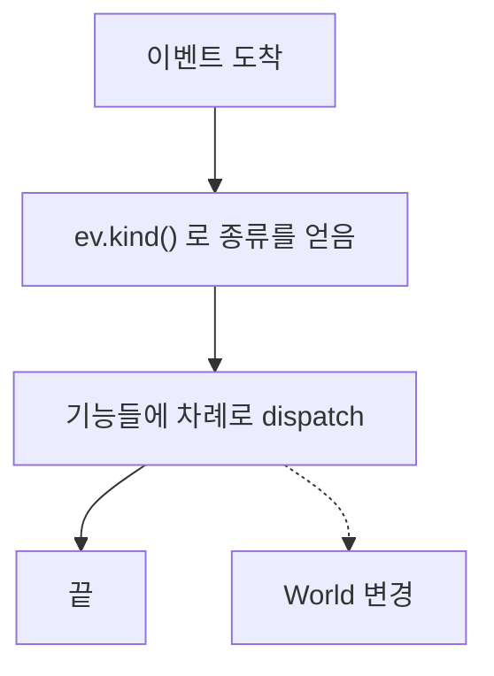
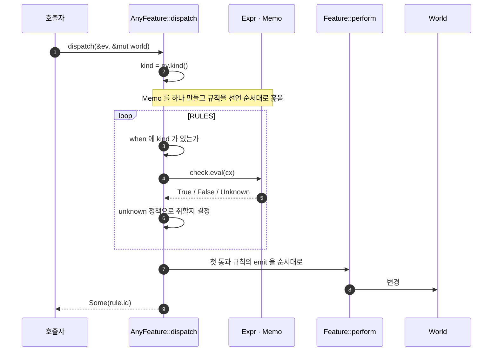
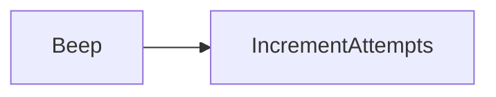

# 3. 실행

이벤트 하나가 들어와서 액션이 실행되기까지의 전 경로입니다. 이 크레이트의
핵심이 여기 있습니다.

## 전체 그림

컨트롤러는 이벤트를 받아 자기가 가진 기능들에 차례로 넘깁니다. 기능들은
서로를 모르며, 순서는 호출자가 정합니다.

앞선 기능이 `World`를 바꾸면 뒤따르는 기능이 그 결과를 봅니다. 액션은
`dispatch`가 반환하기 전에 전부 실행되기 때문입니다.

## 한 기능의 경로

- `when`에 `kind`가 없으면 **가드를 평가하지 않고** 건너뜁니다.
- 통과한 규칙이 없으면 아무 일도 하지 않고 `None`을 반환합니다.
  기능은 여럿 중 하나이므로 안 걸리는 것이 정상이고, 그래서 경고도 없습니다.
- 가드가 `World`를 빌리는 구간은 액션이 `World`를 바꾸기 전에 끝납니다.

## 가드가 평가되는 방식

### 3값 논리

판정은 `bool`이 아니라 셋입니다. `Unknown`은 "알 수 없다"이지 "거짓"이 아닙니다.

| `A` | `B` | `A && B` | `A \|\| B` | `!A` |
|---|---|---|---|---|
| T | T | T | T | F |
| T | F | F | T | F |
| T | U | **U** | **T** | F |
| F | F | F | F | T |
| F | U | **F** | **U** | T |
| U | U | U | U | **U** |

`False` 하나가 `&&`를 결정하고, `True` 하나가 `||`를 결정합니다. 모르는
값이 있어도 답이 정해지면 답이 나옵니다.

### 단축 평가

`Expr`는 왼쪽부터 평가하며 답이 정해지면 오른쪽을 보지 않습니다.

| 노드 | 오른쪽을 건너뛰는 조건 |
|---|---|
| `And(l, r)` | `l`이 `False` |
| `Or(l, r)` | `l`이 `True` |

### Memo

한 번의 `dispatch` 동안 노드 하나는 **한 번만** 평가됩니다. 캐시 키는
노드 이름이고, 캐시는 `dispatch`마다 새로 만들어집니다.

- 같은 노드를 여러 행이 참조해도 비용은 한 번입니다.
- 서로 다른 두 노드 타입이 같은 이름을 쓰면 두 번째가 첫 번째의 답을
  물려받습니다. 그래서 이름이 도메인 안에서 고유해야 하고,
  [`verify::duplicate_node_names`](4-verification.md)가 이를 검사합니다.

### Unknown 을 만났을 때

`Expr`가 `Unknown`을 내면 그 행의 `unknown` 정책이 결론을 냅니다.

| `unknown` | `True` | `False` | `Unknown` |
|---|---|---|---|
| `Deny` | 취함 | 안 취함 | **안 취함** |
| `Allow` | 취함 | 안 취함 | **취함** |

정책이 행에 적혀 있으므로 다이어그램에도 드러납니다. 가드 함수 안에
숨지 않습니다.

## 따라가 보기

[`examples/door_lock`](../examples/door_lock/main.rs)에서 문이 잠겨 있고 틀린
코드가 들어왔으며 시도 횟수는 아직 남은 상황입니다.

`EnterCode`를 덮는 행이 셋 있고, 선언 순서대로 봅니다.

| 순서 | 행 | 조건 | 평가 |
|---|---|---|---|
| 1 | `UNLOCK` | `IsLocked && CodeCorrect` | `IsLocked` → `True`. `CodeCorrect` 평가 → `False`. 탈락 |
| 2 | `WRONG_CODE` | `IsLocked && !CodeCorrect && !AttemptsExceeded` | `IsLocked`와 `CodeCorrect` 둘 다 **캐시에서**. `AttemptsExceeded` 평가 → `False` → `!` 하여 `True`. 통과 |
| 3 | `TRIGGER_ALARM` | — | **도달하지 않음** |

`WRONG_CODE`가 선택되고 `emit`이 순서대로 실행됩니다.

`Some("WRONG_CODE")`가 반환됩니다. 이 행의 액션 중 문의 위치를 쓰는 것이
없으므로 `world.lock`은 그대로입니다.

코드가 맞았다면 `UNLOCK`이 선택되고 `Action::Unlock` 하나가 실행됩니다. 그
액션이 이벤트에서 코드를 읽고 `world.lock`을 `Unlocked`로 옮깁니다 — 문을
여는 것과 열렸다고 적는 것은 한 가지 일입니다.

나중에 `Timeout`으로 `RELOCK`을 타면 그 행의 세 액션이 순서대로 실행됩니다.

| 순서 | 액션 |
|---|---|
| 1 | `ClearUnlockCode` |
| 2 | `Lock` — `world.lock`을 `Locked`로 |
| 3 | `ResetAttempts` |

전이표라면 1번은 `Unlocked`의 `exit`, 2·3번은 `Locked`의 `entry`에 적혔을
것입니다. 표가 하나뿐이므로 셋 다 그 이벤트를 처리한 행에 적혀 있고, 대신
잠김으로 끝나는 다른 두 행도 2·3번을 각자 적어야 합니다.

## 규칙 몇 가지

- **선언 순서가 우선순위입니다.** 한 기능에서 첫 통과 행 하나만 실행합니다.
- **재진입하지 않습니다.** `dispatch`가 `World`를 가변으로 빌리므로 중첩 호출은
  컴파일되지 않습니다. 후속 이벤트는 호출자가 큐에 넣습니다.
- **세상을 바꾸는 곳은 `perform`뿐입니다.** 가드는 `&World`만 봅니다.
  그래서 한 번의 dispatch가 만든 효과 목록이 곧 전부입니다.
- **`dispatch`는 실행된 행의 id를 `Option<&'static str>`로 돌려줍니다.**
