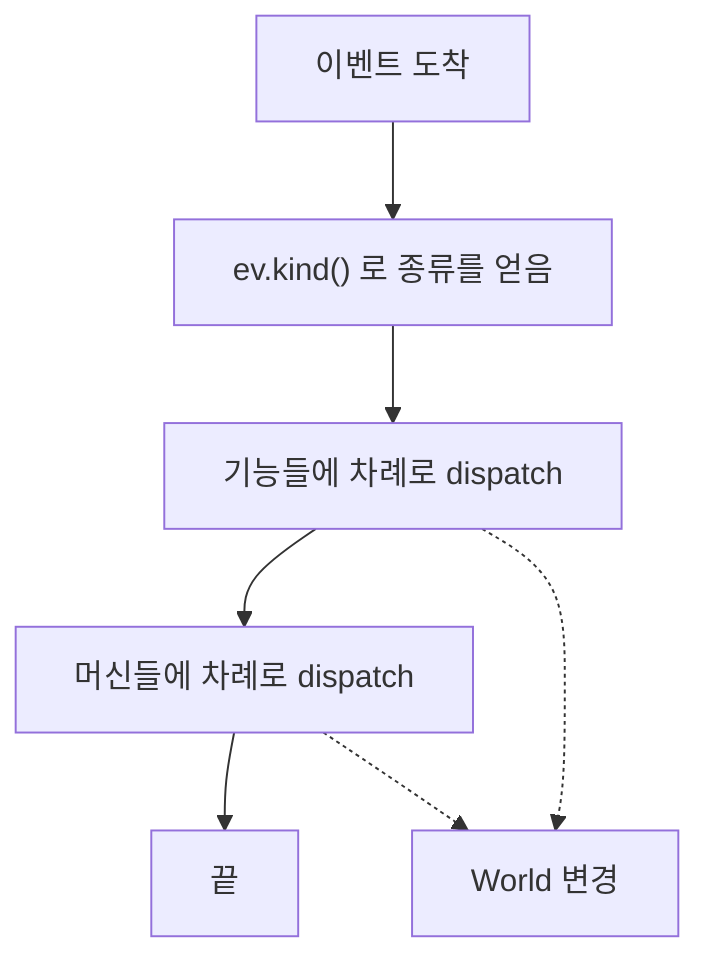
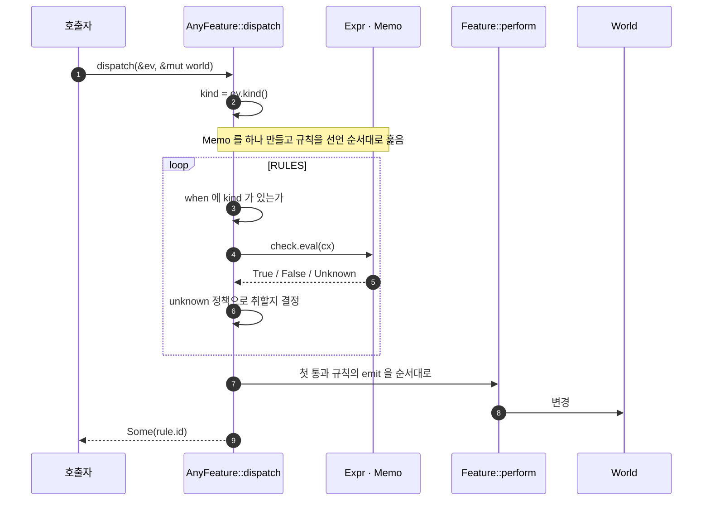
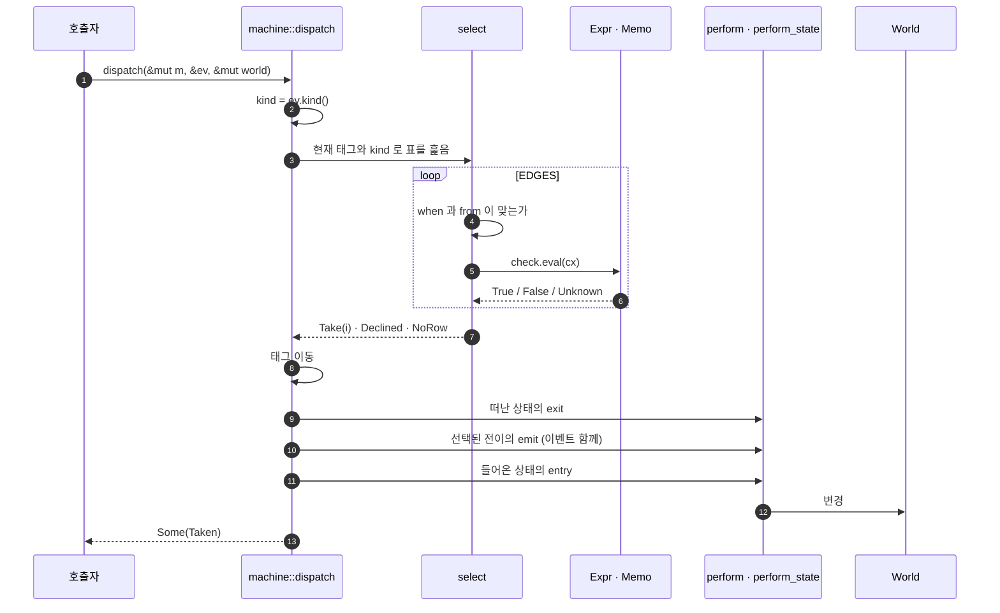
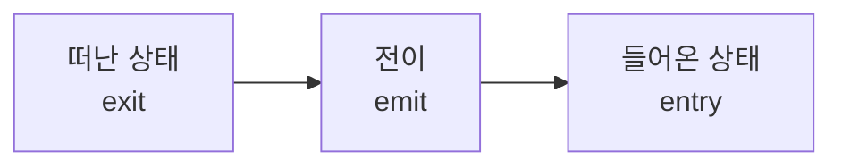
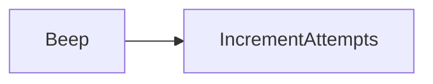

# 3. 실행

이벤트 하나가 들어와서 액션이 실행되기까지의 전 경로입니다. 이 크레이트의
핵심이 여기 있습니다.

## 전체 그림

컨트롤러는 이벤트를 받아 자기가 가진 기능들과 머신들에 차례로 넘깁니다.
두 층은 서로를 모르며, 순서는 호출자가 정합니다.

앞선 기능이 `World`를 바꾸면 뒤따르는 기능과 머신이 그 결과를 봅니다.
액션은 `dispatch`가 반환하기 전에 전부 실행되기 때문입니다.

## 기능 층의 경로

- `when`에 `kind`가 없으면 **가드를 평가하지 않고** 건너뜁니다.
- 통과한 규칙이 없으면 아무 일도 하지 않고 `None`을 반환합니다.
  기능은 여럿 중 하나이므로 안 걸리는 것이 정상이고, 그래서 경고도 없습니다.
- 가드가 `World`를 빌리는 구간은 액션이 `World`를 바꾸기 전에 끝납니다.

## 머신 층의 경로

### select 의 세 가지 결과

`when`과 `from`이 맞는 행을 **행 자체가 있었는지**와 **가드가 통과했는지**로
나눠 봅니다. 이 구분이 결함과 정상 동작을 가릅니다.

| 결과 | 언제 | 반환 | 로그 |
|---|---|---|---|
| `Take(i)` | 가드까지 통과한 첫 행 | `Some(Taken)` | `debug` |
| `Declined` | 행은 있으나 모든 가드가 거절 | `None` | `debug` — 정상 동작 |
| `NoRow` | 그 조합을 덮는 행이 아예 없음 | `None` | `warn` — 단 `Ignore`가 있으면 침묵 |

`NoRow`는 원래 `verify::coverage`가 정적으로 잡습니다. 런타임에 도달했다면
릴리스 빌드이거나 `all_tags`/`all_kinds`가 좁혀진 경우입니다.

### 효과 실행 순서

| `goto` | exit | emit | entry |
|---|---|---|---|
| `To(tag)` | 실행 | 실행 | 실행 |
| `Internal` | **건너뜀** | 실행 | **건너뜀** |

`Internal`은 상태를 떠나지 않으므로 진입·이탈이 일어나지 않습니다. 같은
상태로 가는 `To(같은 태그)`와는 다릅니다. 그쪽은 나갔다 들어온 것이므로
exit과 entry가 모두 실행됩니다.

`Machine::new`는 **이어서 시작합니다.** 초기 태그는 세상이 이미 그 상태라는
뜻이므로 그 상태의 `entry`는 실행되지 않습니다.

## 가드가 평가되는 방식

### 3값 논리

판정은 `bool`이 아니라 셋입니다. `Unknown`은 "알 수 없다"이지 "거짓"이 아닙니다.

| `A` | `B` | `A && B` | `A \|\| B` | `!A` |
|---|---|---|---|---|
| T | T | T | T | F |
| T | F | F | T | F |
| T | U | **U** | **T** | F |
| F | F | F | F | T |
| F | U | **F** | **U** | T |
| U | U | U | U | **U** |

`False` 하나가 `&&`를 결정하고, `True` 하나가 `||`를 결정합니다. 모르는
값이 있어도 답이 정해지면 답이 나옵니다.

### 단축 평가

`Expr`는 왼쪽부터 평가하며 답이 정해지면 오른쪽을 보지 않습니다.

| 노드 | 오른쪽을 건너뛰는 조건 |
|---|---|
| `And(l, r)` | `l`이 `False` |
| `Or(l, r)` | `l`이 `True` |

### Memo

한 번의 `dispatch` 동안 노드 하나는 **한 번만** 평가됩니다. 캐시 키는
노드 이름이고, 캐시는 `dispatch`마다 새로 만들어집니다.

- 같은 노드를 여러 행이 참조해도 비용은 한 번입니다.
- 서로 다른 두 노드 타입이 같은 이름을 쓰면 두 번째가 첫 번째의 답을
  물려받습니다. 그래서 이름이 도메인 안에서 고유해야 하고,
  [`verify::duplicate_node_names`](4-verification.md)가 이를 검사합니다.

### Unknown 을 만났을 때

`Expr`가 `Unknown`을 내면 그 행의 `unknown` 정책이 결론을 냅니다.

| `unknown` | `True` | `False` | `Unknown` |
|---|---|---|---|
| `Deny` | 취함 | 안 취함 | **안 취함** |
| `Allow` | 취함 | 안 취함 | **취함** |

정책이 행에 적혀 있으므로 다이어그램에도 드러납니다. 가드 함수 안에
숨지 않습니다.

## 따라가 보기

[`examples/door_lock`](../examples/door_lock/main.rs)에서 `Locked` 상태일 때
틀린 코드가 들어오고 시도 횟수는 아직 남은 상황입니다.

`Locked` × `EnterCode`를 덮는 행이 셋 있고, 선언 순서대로 봅니다.

| 순서 | 행 | 조건 | 평가 |
|---|---|---|---|
| 1 | `UNLOCK` | `CodeCorrect` | `CodeCorrect` 평가 → `False`. 탈락 |
| 2 | `WRONG_CODE` | `!CodeCorrect && !AttemptsExceeded` | `CodeCorrect`는 **캐시에서** `False` → `!` 하여 `True`. `AttemptsExceeded` 평가 → `False` → `!` 하여 `True`. 통과 |
| 3 | `TRIGGER_ALARM` | — | **도달하지 않음** |

`WRONG_CODE`가 선택됩니다. `goto`가 `Internal`이므로 상태는 그대로이고
`emit`만 실행됩니다.

`Taken { edge: "WRONG_CODE", exit: [], emit: [Beep, IncrementAttempts], entry: [] }`
이 반환됩니다.

만약 코드가 맞았다면 `UNLOCK`이 선택되고 `goto`가 `To(Unlocked)`이므로
실행 순서가 이렇게 됩니다.

| 단계 | 내용 |
|---|---|
| exit | `Locked`의 `exit` — 비어 있음 |
| emit | `Unlock` — 이벤트에서 입력된 코드를 읽음 |
| entry | `Unlocked`의 `entry` — 비어 있음 |

그리고 나중에 `Timeout`으로 `RELOCK`을 타면 `Unlocked`의 `exit`인
`ClearUnlockCode`와 `Locked`의 `entry`인 `Lock`, `ResetAttempts`가 순서대로
실행됩니다.

## 규칙 몇 가지

- **선언 순서가 우선순위입니다.** 두 층 모두 첫 통과 행 하나만 실행합니다.
- **재진입할 수 없습니다.** `dispatch`가 머신을 가변으로 빌리므로 중첩 호출은
  컴파일되지 않습니다. 후속 이벤트는 호출자가 큐에 넣습니다.
- **세상을 바꾸는 곳은 `perform`뿐입니다.** 가드는 `&World`만 봅니다.
  그래서 한 번의 dispatch가 만든 효과 목록이 곧 전부입니다.
- **`dispatch`는 실행된 행의 id를 돌려줍니다.** 머신은 `Taken`으로,
  기능은 `Option<&'static str>`로 돌려줍니다.
