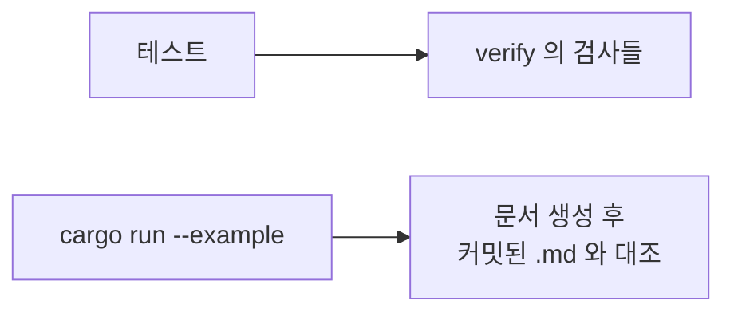

# 4. 검사

표를 읽어 결함을 찾아내는 쪽과, 같은 표에서 문서를 만들어내는 쪽입니다.
둘 다 실행에는 관여하지 않습니다.

## 언제 도는가



실행 경로는 `verify`를 부르지 않습니다. **테스트에서 부르는 것이 유일한
방어선**입니다.

## 검사 목록

| 함수 | 무엇을 잡나 |
|---|---|
| `duplicate_node_names(features)` | 도메인 안에서 한 가드 이름을 두 노드 타입이 씀 |
| `duplicate_rule_ids(features)` | 컨트롤러 안에서 같은 규칙 `id`가 둘 |
| `unhandled_kinds(features)` | 아무 규칙도 반응하지 않는 이벤트 종류 |
| `unemitted_actions::<F>()` | 선언했으나 어떤 규칙도 내지 않는 죽은 액션 |

앞의 셋은 **컨트롤러 전체**를 받습니다. 기능 하나만 봐서는 알 수 없는 것들이기
때문입니다.

가드 이름 충돌이 대표적입니다. 기능 둘이 각각 하나씩만 이름 지으면 따로 볼 때는
둘 다 깨끗한데, 합치면 같은 이름에 서로 다른 두 노드 타입이 붙어 있습니다.
`Memo`가 이름을 키로 쓰므로 두 번째 노드는 자기 판정을 돌리지도 못한 채 첫
번째의 답을 물려받습니다.

규칙 `id`도 같습니다. `dispatch`가 돌려주는 id에는 기능 이름이 붙어 있지
않으므로, 컨트롤러 안에서 고유해야 하나의 규칙을 가리킬 수 있습니다.

`unhandled_kinds`가 보고하는 것이 전부 결함은 아닙니다. 컨트롤러가 `World`로
흡수하기만 하고 아무 판단도 내리지 않는 신호도 여기 걸립니다. 그게 요점입니다 —
아무도 받지 않는 이벤트는 누군가 읽은 한 줄이어야지 침묵이면 안 됩니다.

## 테스트에 넣는 모양

```rust
#[test]
fn tables_are_clean() {
    let dup = verify::duplicate_node_names(FEATURES);
    assert!(dup.is_empty(), "{dup:?}");

    let ids = verify::duplicate_rule_ids(FEATURES);
    assert!(ids.is_empty(), "{ids:?}");

    assert!(verify::unemitted_actions::<Heating>().is_empty());
}
```

`unhandled_kinds`는 assert 대신 생성 문서에 찍는 편이 낫습니다. 흡수만 하는
신호가 섞여 있어 빈 목록이 정답이 아닐 수 있기 때문입니다.

## 생성되는 문서

같은 표에서 나옵니다. 실행기가 읽는 데이터와 같은 것을 읽으므로 어긋날 수
없습니다.

| 함수 | 산출물 |
|---|---|
| `render::io_table` | 기능별 입력·출력 요약 |
| `render::rule_table` | 규칙 한 줄씩 |
| `render::event_table` | 이벤트 하나에 걸리는 규칙 전부, 기능을 가로질러 |
| `render::event_flowchart` | mermaid 흐름도 — 이벤트 하나 → 기능 → 액션 |

이름 규칙은 내용 기준입니다. `*_flowchart`는 mermaid 소스를,
`*_table`은 마크다운 표를 돌려줍니다.

`event_*` 둘은 이벤트 **하나**만 받습니다. 사양이 "무엇이 왔을 때 어떤
조건이면 무엇을 한다"로 쓰이므로, 문서도 같은 단위로 뽑아 나란히 놓고
대조합니다.

## 커밋된 .md 가 곧 테스트

예제는 문서를 다시 만들어 커밋된 파일과 대조하고, 어긋나면 실패합니다.

```sh
cargo run --example door_lock          # 검사
cargo run --example mirrors            # 검사
cargo run --example mirrors -- --write # 의도한 변경 뒤 재생성
```

`render`에는 별도의 단위 테스트 대신 이 방식이 붙어 있습니다. 출력이 바뀌면
`.md`의 diff로 정확히 무엇이 바뀌었는지 보이고, 의도한 변경이면 `--write`로
갱신한 뒤 그 diff를 함께 커밋합니다.

## 검사가 잡지 못하는 것

정직하게 적어 둡니다.

- **가드의 내용** — `CodeCorrect`가 정말 코드를 맞게 비교하는지는 검사하지
  않습니다. 검사 대상은 표의 구조입니다.
- **가드 조합 공간** — 한 이벤트에 걸린 규칙들이 조건의 어떤 조합에서도 답을
  내는지, 어느 규칙이 앞 규칙에 완전히 가려져 있는지는 아무도 묻지 않습니다.
  `Expr`가 이름 붙은 노드의 트리로 남아 있으므로 답할 수는 있지만, 아직
  만들지 않았습니다. 전이표가 있던 시절의 `(상태 × 이벤트)` 전수 검사가
  사라진 자리가 여기입니다.
- **라우팅** — 어떤 기능을 어떤 순서로 부를지, 어떤 이벤트를 통째로 버릴지는
  아직 호출자가 손으로 쓰는 코드이고, 표가 아니므로 검사 밖입니다.
- **부르지 않은 검사** — `verify`는 실행 경로에 없습니다. 테스트나 예제에서
  부르지 않으면 아무것도 검사되지 않습니다.
