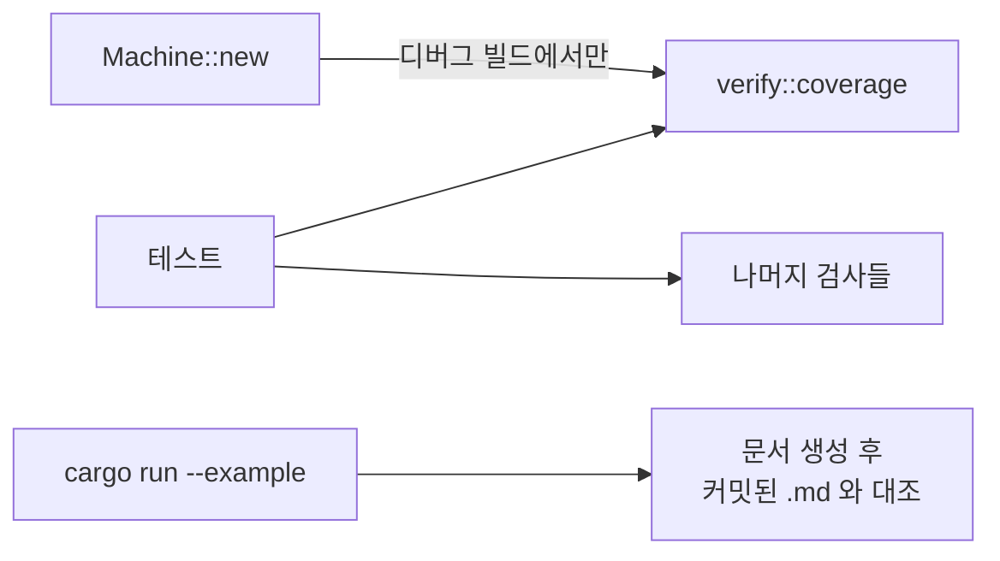

# 4. 검사

표를 읽어 결함을 찾아내는 쪽과, 같은 표에서 문서를 만들어내는 쪽입니다.
둘 다 실행에는 관여하지 않습니다.

## 언제 도는가



`Machine::new`는 디버그 빌드에서 자기 표의 `coverage`를 assert합니다.
릴리스에서는 건너뛰므로, **테스트에서 직접 부르는 것이 실제 방어선**입니다.

## 머신 하나에 대한 검사

`verify::coverage::<M>(initial, EDGES, IGNORES)`가 `Coverage`를 돌려줍니다.

| 항목 | 무엇을 잡나 | `is_clean()` |
|---|---|---|
| `holes` | 엣지도 `Ignore`도 없는 `(상태 × 이벤트)` 조합 | 포함 |
| `ignored_but_handled` | `Ignore`로 막아 둔 조합을 엣지가 처리함 | 포함 |
| `unreachable` | 초기 상태에서 도달할 수 없는 상태 | 포함 |
| `duplicate_node_names` | 한 이름을 두 노드 타입이 씀 | 포함 |
| `duplicate_edge_ids` | 같은 `id`를 두 엣지가 씀 | 포함 |
| `overlaps` | 한 조합을 여러 엣지가 덮음 | **제외** |

`overlaps`만 빠져 있습니다. 선언 순서가 우선순위이므로 겹침 자체는 정상이고,
다만 검토할 만한 신호이기에 보고만 합니다.

`machine` 필드에 `MachineSpec::NAME`이 담기므로, 머신 여럿을 검사할 때
어느 쪽이 실패했는지 보고서가 스스로 말합니다.

## 컨트롤러 전체에 대한 검사

한 머신만 봐서는 알 수 없는 것들입니다.

| 함수 | 무엇을 잡나 |
|---|---|
| `duplicate_node_names(features, elsewhere)` | 도메인 안에서 한 가드 이름을 두 노드 타입이 씀 |
| `duplicate_rule_ids(features)` | 컨트롤러 안에서 같은 규칙 `id`가 둘 |
| `unhandled_kinds(features, elsewhere)` | 아무 기능도 머신도 받지 않는 이벤트 종류 |
| `unemitted_actions::<F>()` | 선언했으나 어떤 규칙도 내지 않는 죽은 액션 |

`elsewhere`에는 머신 쪽 정보를 넣습니다. 두 층을 섞은 컨트롤러를 하나의
단위로 검사하기 위한 자리입니다.

| 짝 | 머신 쪽에서 얻는 값 |
|---|---|
| `unhandled_kinds` | `verify::handled_kinds::<M>(EDGES)` |
| `duplicate_node_names` | `verify::guard_nodes::<M>(EDGES)` |

### 왜 컨트롤러 전체를 봐야 하나

가드 이름 충돌이 대표적입니다. 기능 하나만 봐도, 머신 하나만 봐도 깨끗한데
둘을 합치면 같은 이름에 서로 다른 두 노드 타입이 붙어 있을 수 있습니다.
`Memo`가 이름을 키로 쓰므로 두 번째 노드는 자기 판정을 돌리지도 못한 채
첫 번째의 답을 물려받습니다.

규칙 `id`도 같습니다. `dispatch`가 돌려주는 id에는 기능 이름이 붙어 있지
않으므로, 컨트롤러 안에서 고유해야 하나의 규칙을 가리킬 수 있습니다.

## 테스트에 넣는 모양

두 층을 섞은 컨트롤러라면 이 정도입니다.

```rust
#[test]
fn tables_are_clean() {
    // 머신별 — 구멍, 도달 불가 상태, 중복 id
    assert!(fold::coverage().is_clean());

    // 컨트롤러 전체 — 어떤 coverage 로도 볼 수 없는 것들
    let dup = verify::duplicate_node_names(FEATURES, &[&fold::guard_nodes()]);
    assert!(dup.is_empty(), "{dup:?}");

    let ids = verify::duplicate_rule_ids(FEATURES);
    assert!(ids.is_empty(), "{ids:?}");
}
```

머신이 하나뿐이라면 `duplicate_node_names`는 굳이 필요 없습니다.
`Machine::new`가 디버그 빌드에서 `coverage`를 검사하므로 테스트만 돌려도
걸립니다. 이 함수가 필요해지는 것은 **기능이 하나라도 있거나 머신이 둘
이상일 때**입니다.

## 생성되는 문서

같은 표에서 나옵니다. 실행기가 읽는 데이터와 같은 것을 읽으므로 어긋날 수
없습니다.

| 함수 | 산출물 | 대상 |
|---|---|---|
| `render::state_diagram` | mermaid `stateDiagram-v2` | 머신 |
| `render::internal_table` | 제자리 전이 표 | 머신 |
| `render::ignore_table` | 일부러 처리하지 않는 조합과 그 이유 | 머신 |
| `render::io_table` | 기능별 입력·출력 요약 | 기능 |
| `render::rule_table` | 규칙 한 줄씩 | 기능 |
| `render::io_flowchart` | mermaid 흐름도 — 이벤트 → 기능 → 액션 | 기능 |

이름 규칙은 내용 기준입니다. `*_diagram`과 `*_flowchart`는 mermaid 소스를,
`*_table`은 마크다운 표를 돌려줍니다.

`state_diagram`이 그리지 않는 것이 하나 있습니다. `Goto::Internal` 전이는
상태를 바꾸지 않아 화살표가 되지 않으므로 `internal_table`이 맡습니다.

PlantUML이 필요하면 `scripts/mermaid_to_plantuml.sh`로 변환합니다.

## 커밋된 .md 가 곧 테스트

예제는 문서를 다시 만들어 커밋된 파일과 대조하고, 어긋나면 실패합니다.

```sh
cargo run --example door_lock          # 검사
cargo run --example mirrors            # 검사
cargo run --example mirrors -- --write # 의도한 변경 뒤 재생성
```

`render`에는 별도의 단위 테스트 대신 이 방식이 붙어 있습니다. 출력이 바뀌면
`.md`의 diff로 정확히 무엇이 바뀌었는지 보이고, 의도한 변경이면 `--write`로
갱신한 뒤 그 diff를 함께 커밋합니다.

## 검사가 잡지 못하는 것

정직하게 적어 둡니다.

- **가드의 내용** — `CodeCorrect`가 정말 코드를 맞게 비교하는지는 검사하지
  않습니다. 검사 대상은 표의 구조입니다.
- **라우팅** — 어떤 기능을 어떤 순서로 부를지, 어떤 이벤트를 통째로 버릴지는
  아직 호출자가 손으로 쓰는 코드이고, 표가 아니므로 검사 밖입니다.
- **릴리스 빌드의 표** — `Machine::new`의 자동 검사는 디버그 전용입니다.
  테스트에서 부르지 않으면 릴리스에서는 아무것도 검사되지 않습니다.
