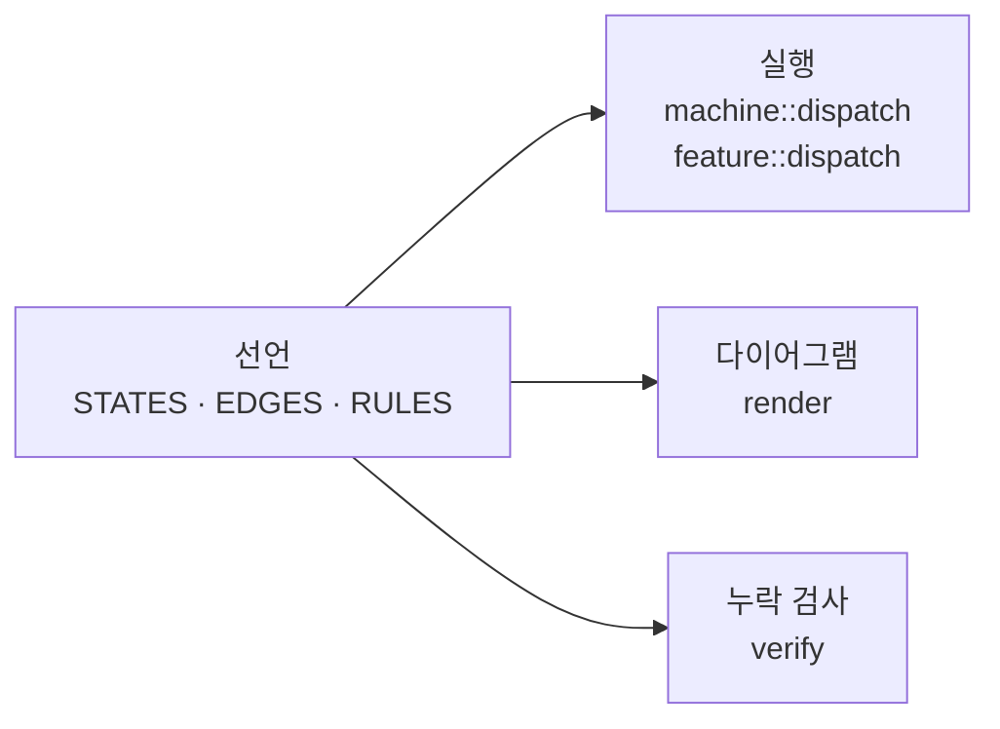

# declared 개발자 문서

이 크레이트를 쓰면서 동시에 내부가 어떻게 도는지 알고 싶은 사람을 위한
문서입니다. 사용법과 구조를 같은 자리에서 설명하므로, 코드를 열지 않아도
세부 동작까지 따라올 수 있습니다.

## 읽는 순서

| 문서 | 답하는 질문 |
|---|---|
| [1. 구조](1-structure.md) | 파일이 어떻게 나뉘어 있고 무엇이 무엇을 아는가 |
| [2. 선언](2-declaration.md) | 무엇을 어떤 타입으로 적는가 |
| [3. 실행](3-dispatch.md) | 이벤트 하나가 액션까지 어떤 경로로 가는가 |
| [4. 검사](4-verification.md) | 무엇이 자동으로 검증되고 무엇이 생성되는가 |

처음이라면 1 → 2 → 3 순서를 권합니다. 3번이 이 크레이트의 핵심입니다.

## 한 장 요약

선언 하나가 세 가지를 만들어냅니다.

## 어휘

문서 전체에서 이 이름들을 씁니다.

| 이름 | 무엇인가 |
|---|---|
| `Domain` | 한 컨트롤러가 공유하는 것: 이벤트 타입, 이벤트 종류, 세상 |
| `World` | 컨트롤러가 읽고 바꾸는 대상. 가드는 읽기만, `perform`만 쓰기 |
| `Feature` | 상태가 없는 층. 규칙(`Rule`) 표 하나가 전부 |
| `MachineSpec` | 상태가 있는 층. 상태(`State`)·전이(`Edge`)·무시(`Ignore`) 표 |
| `Machine` | `MachineSpec`을 실제로 돌리는 인스턴스. 현재 태그만 들고 있음 |
| `Action` | 이벤트에 반응해 내는 효과. 이벤트를 볼 수 있음 |
| `StateAction` | 상태에 들어가고 나올 때의 효과. 이벤트를 볼 수 없음 |
| `Cond` | 가드 판정 결과. `True` / `False` / `Unknown` |
| `Expr` | 가드 노드를 `&&` · `!` · `||`로 엮은 트리 |

## 두 층을 언제 쓰는가

- **`feature`** — 동작이 과거에 의존하지 않을 때. "지금 세상이 이러면 이걸 한다"
- **`machine`** — 같은 이벤트가 상태에 따라 다른 뜻을 가질 때. "어디에 있었느냐가 답을 바꾼다"

둘은 `Domain`을 공유하므로 한 컨트롤러 안에 섞어 쓸 수 있습니다. 예제는 각
층을 따로 보여줍니다 — [`examples/door_lock`](../examples/door_lock/main.rs)은
머신, [`examples/mirrors`](../examples/mirrors/main.rs)는 기능입니다.
