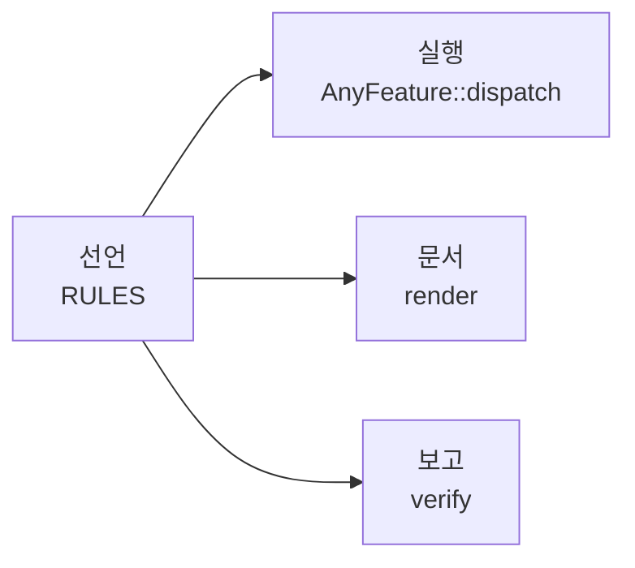

# declared 개발자 문서

이 크레이트를 쓰면서 동시에 내부가 어떻게 도는지 알고 싶은 사람을 위한
문서입니다. 사용법과 구조를 같은 자리에서 설명하므로, 코드를 열지 않아도
세부 동작까지 따라올 수 있습니다.

## 읽는 순서

| 문서 | 답하는 질문 |
|---|---|
| [1. 구조](1-structure.md) | 파일이 어떻게 나뉘어 있고 무엇이 무엇을 아는가 |
| [2. 선언](2-declaration.md) | 무엇을 어떤 타입으로 적는가 |
| [3. 실행](3-dispatch.md) | 이벤트 하나가 액션까지 어떤 경로로 가는가 |
| [4. 검사](4-verification.md) | 무엇이 자동으로 검증되고 무엇이 생성되는가 |

처음이라면 1 → 2 → 3 순서를 권합니다. 3번이 이 크레이트의 핵심입니다.

## 한 장 요약

선언 하나가 세 가지를 만들어냅니다.

## 어휘

문서 전체에서 이 이름들을 씁니다.

| 이름 | 무엇인가 |
|---|---|
| `Domain` | 한 컨트롤러가 공유하는 것: 이벤트 타입, 이벤트 종류, 세상 |
| `World` | 컨트롤러가 읽고 바꾸는 대상. 가드는 읽기만, `perform`만 쓰기 |
| `Feature` | 컨트롤러의 한 관심사. 규칙(`Rule`) 표 하나가 전부 |
| `Rule` | 표의 한 행. `when` · `check` · `unknown` · `emit` |
| `Action` | 규칙이 내는 효과. 원인이 된 이벤트를 볼 수 있음 |
| `Cond` | 가드 판정 결과. `True` / `False` / `Unknown` |
| `Expr` | 가드 노드를 `&&` · `!` · `||`로 엮은 트리 |

## 상태는 어디에 있는가

전용 층은 없습니다. 같은 이벤트가 상황에 따라 다른 뜻을 갖는다면, 그 상황을
`World`의 필드로 두고 가드가 읽습니다. 필드를 옮기는 것도 액션이고요.

[`examples/door_lock`](../examples/door_lock/main.rs)이 그 예입니다 — 위치가
넷인 잠금장치라 이 방식에 가장 불리하고, 그래서 무엇을 잃는지가 표에 그대로
보입니다.
