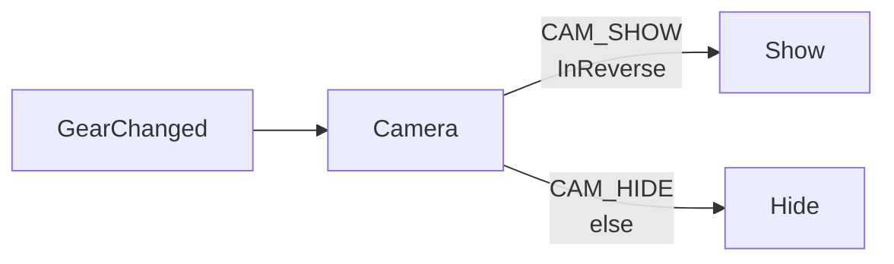
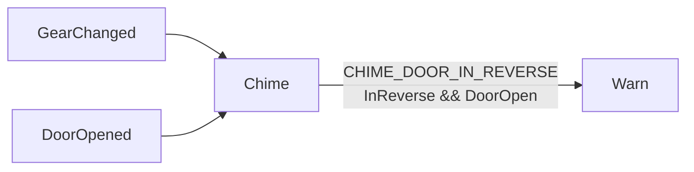

# Rear camera

Shows the camera in reverse, and chimes if a door opens while reversing.

## Rules

Within a feature, the first rule whose guard holds runs.

| feature | rule | when | guard | emits |
|---|---|---|---|---|
| `Camera` | `CAM_SHOW` | `GearChanged` | `InReverse` | `Show` |
| `Camera` | `CAM_HIDE` | `GearChanged` | else | `Hide` |
| `Chime` | `CHIME_DOOR_IN_REVERSE` | `GearChanged`, `DoorOpened` | `InReverse && DoorOpen` | `Warn` |

## Camera on [GearChanged]

## Chime on [GearChanged, DoorOpened]

## Checks

| Check | Result |
|---|---|
| Events nothing handles | [] |
| Guard names used by two node types | [] |
| Rules with no event or no action | [] |
| Camera actions never emitted | [] |
| Chime actions never emitted | [] |
