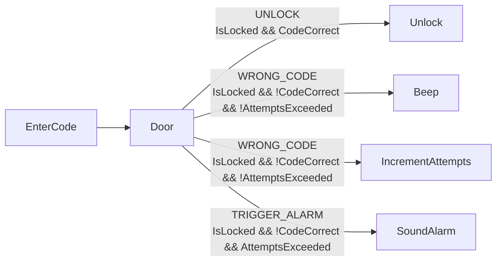
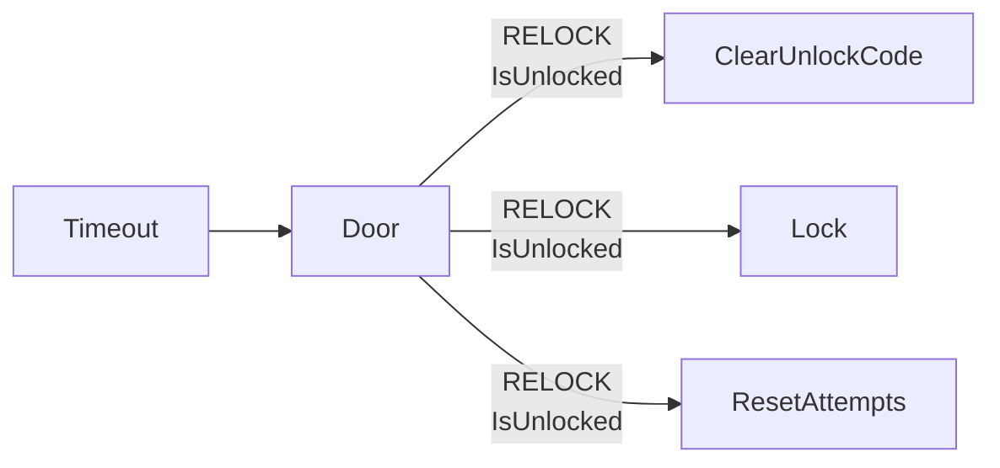
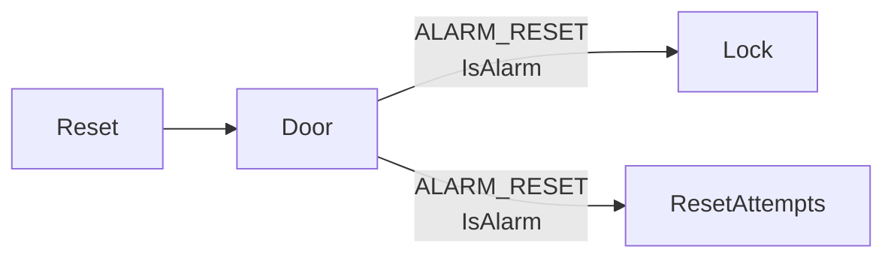
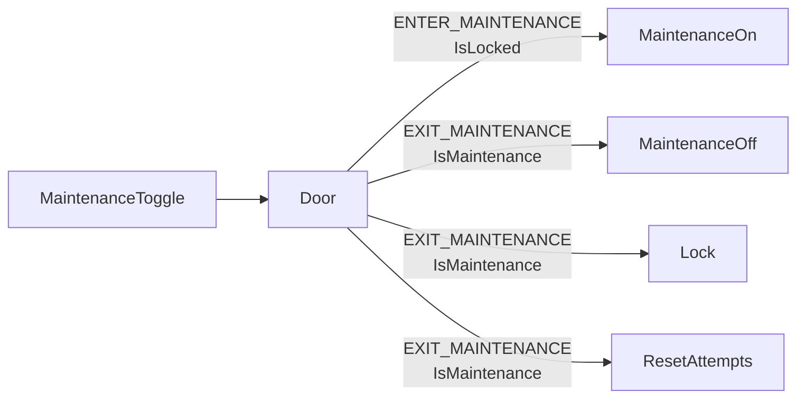

# Door lock

A four-digit lock, written as one rule table. Generated from the declaration —
regenerate with `cargo run --example door_lock -- --write`.

## Rules

Where the lock is, is a condition like any other: `IsLocked` and its three
siblings read one field of the world, and the actions that move the lock write
it. So a row carries every effect of the event it matched, including the one a
transition table would have hidden in a state's entry list.

That is also what the repetition below is. `RELOCK`, `ALARM_RESET` and
`EXIT_MAINTENANCE` all end with the door locked, so all three say
`Lock, ResetAttempts`.

| feature | rule | when | guard | emits |
|---|---|---|---|---|
| `Door` | `UNLOCK` | `EnterCode` | `IsLocked && CodeCorrect` | `Unlock` |
| `Door` | `WRONG_CODE` | `EnterCode` | `IsLocked && !CodeCorrect && !AttemptsExceeded` | `Beep`, `IncrementAttempts` |
| `Door` | `TRIGGER_ALARM` | `EnterCode` | `IsLocked && !CodeCorrect && AttemptsExceeded` | `SoundAlarm` |
| `Door` | `RELOCK` | `Timeout` | `IsUnlocked` | `ClearUnlockCode`, `Lock`, `ResetAttempts` |
| `Door` | `ALARM_RESET` | `Reset` | `IsAlarm` | `Lock`, `ResetAttempts` |
| `Door` | `ENTER_MAINTENANCE` | `MaintenanceToggle` | `IsLocked` | `MaintenanceOn` |
| `Door` | `EXIT_MAINTENANCE` | `MaintenanceToggle` | `IsMaintenance` | `MaintenanceOff`, `Lock`, `ResetAttempts` |

## By event

### EnterCode

| feature | rule | when | guard | emits |
|---|---|---|---|---|
| `Door` | `UNLOCK` | `EnterCode` | `IsLocked && CodeCorrect` | `Unlock` |
| `Door` | `WRONG_CODE` | `EnterCode` | `IsLocked && !CodeCorrect && !AttemptsExceeded` | `Beep`, `IncrementAttempts` |
| `Door` | `TRIGGER_ALARM` | `EnterCode` | `IsLocked && !CodeCorrect && AttemptsExceeded` | `SoundAlarm` |

### Timeout

| feature | rule | when | guard | emits |
|---|---|---|---|---|
| `Door` | `RELOCK` | `Timeout` | `IsUnlocked` | `ClearUnlockCode`, `Lock`, `ResetAttempts` |

### Reset

| feature | rule | when | guard | emits |
|---|---|---|---|---|
| `Door` | `ALARM_RESET` | `Reset` | `IsAlarm` | `Lock`, `ResetAttempts` |

### MaintenanceToggle

| feature | rule | when | guard | emits |
|---|---|---|---|---|
| `Door` | `ENTER_MAINTENANCE` | `MaintenanceToggle` | `IsLocked` | `MaintenanceOn` |
| `Door` | `EXIT_MAINTENANCE` | `MaintenanceToggle` | `IsMaintenance` | `MaintenanceOff`, `Lock`, `ResetAttempts` |

## Checks

| Check | Result |
|---|---|
| Events nothing handles | [] |
| Guard names used by two node types | [] |
| Rule ids used twice | [] |
| Actions never emitted | [] |
