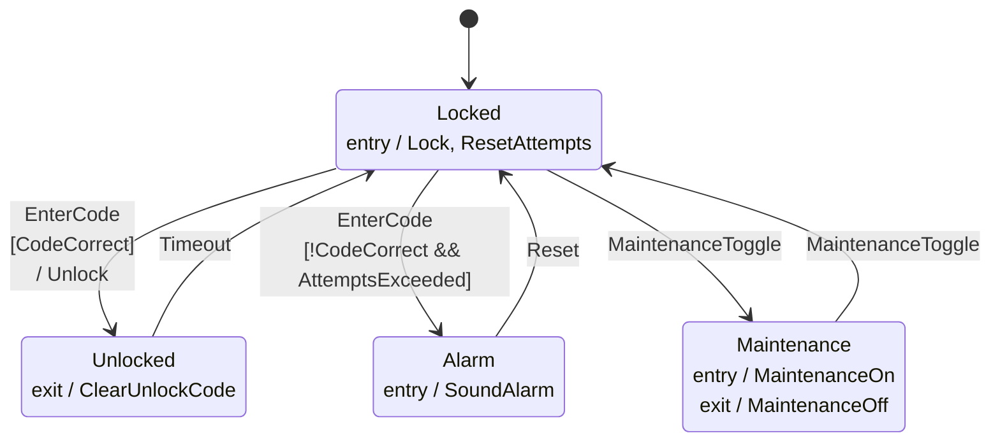

# Door lock FSM

```mermaid
stateDiagram-v2
    [*] --> Locked
    Locked : Locked<br/>entry / Lock, ResetAttempts
    Unlocked : Unlocked<br/>exit / ClearUnlockCode
    Alarm : Alarm<br/>entry / SoundAlarm
    Maintenance : Maintenance<br/>entry / MaintenanceOn<br/>exit / MaintenanceOff
    Locked --> Unlocked: EnterCode<br/>[CodeCorrect]<br/>/ Unlock
    Locked --> Alarm: EnterCode<br/>[!CodeCorrect && AttemptsExceeded]
    Unlocked --> Locked: Timeout
    Alarm --> Locked: Reset
    Locked --> Maintenance: MaintenanceToggle
    Maintenance --> Locked: MaintenanceToggle
```
