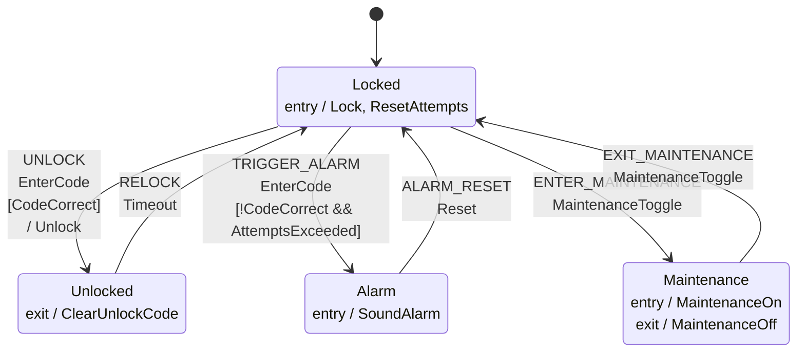

# Door lock FSM

## Transitions

## In-place transitions

Edges that stay in their state. They run their actions but move nothing, so the
diagram above does not draw them.

| state | event | guard | actions | edge id |
|---|---|---|---|---|
| `Locked` | `EnterCode` | `!CodeCorrect && !AttemptsExceeded` | Beep, IncrementAttempts | `WRONG_CODE` |

## Deliberately unhandled

Combinations no edge covers on purpose, each with its reason.

| state | event | reason |
|---|---|---|
| `Locked` | `Timeout` | the timeout only drives the automatic relock from Unlocked |
| `Alarm` | `Timeout` | the timeout only drives the automatic relock from Unlocked |
| `Maintenance` | `Timeout` | the timeout only drives the automatic relock from Unlocked |
| `Locked` | `Reset` | Reset clears the alarm, so it is only meaningful in Alarm |
| `Unlocked` | `Reset` | Reset clears the alarm, so it is only meaningful in Alarm |
| `Maintenance` | `Reset` | Reset clears the alarm, so it is only meaningful in Alarm |
| `Unlocked` | `EnterCode` | a code is entered to unlock, so it is only accepted in Locked |
| `Alarm` | `EnterCode` | a code is entered to unlock, so it is only accepted in Locked |
| `Maintenance` | `EnterCode` | a code is entered to unlock, so it is only accepted in Locked |
| `Unlocked` | `MaintenanceToggle` | maintenance is toggled only between Locked and Maintenance |
| `Alarm` | `MaintenanceToggle` | maintenance is toggled only between Locked and Maintenance |
