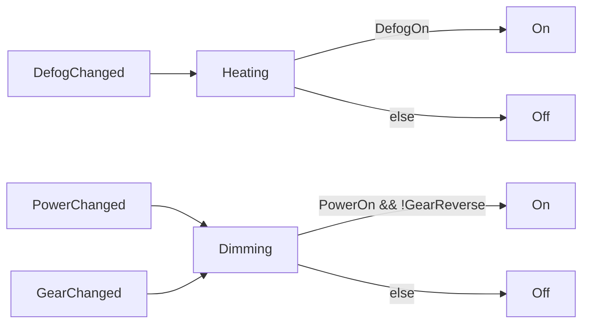
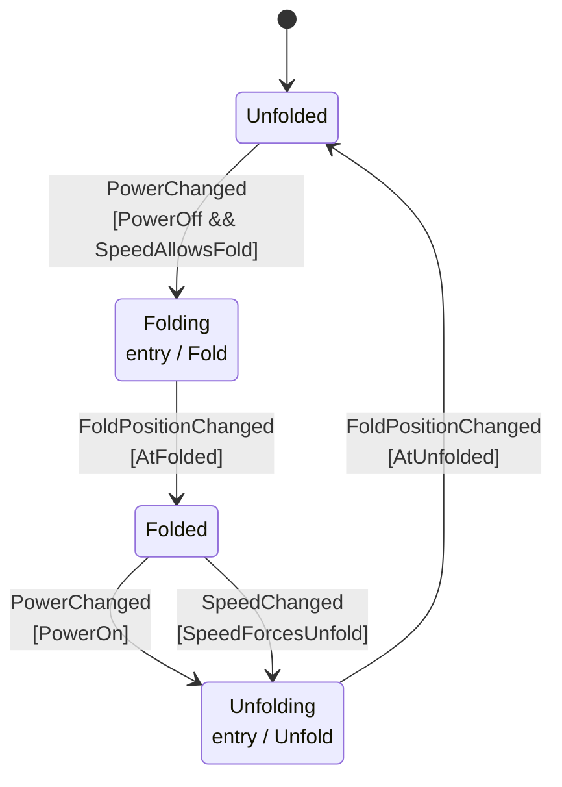

# Mirrors controller

What this controller reacts to and what it does about it. Generated from the
declarations, so it cannot drift from the code — regenerate with
`cargo run --example mirrors`.

## Features

Stateless features, one per file. `handles` and `emits` are read off the rules
below, so a feature cannot react to or emit anything this table omits.

| feature | handles | emits |
|---|---|---|
| `Heating` | `DefogChanged` | `On`, `Off` |
| `Dimming` | `PowerChanged`, `GearChanged` | `On`, `Off` |

## Rules

One line per `input -> output` rule. Within a feature the order is priority: the
first rule whose guard holds is the one that runs, so a rule with no guard is a
fallback.

| feature | rule | when | guard | emits |
|---|---|---|---|---|
| `Heating` | `HEAT_ON` | `DefogChanged` | `DefogOn` | `On` |
| `Heating` | `HEAT_OFF` | `DefogChanged` | else | `Off` |
| `Dimming` | `DIM_ON` | `PowerChanged`, `GearChanged` | `PowerOn && !GearReverse` | `On` |
| `Dimming` | `DIM_OFF` | `PowerChanged`, `GearChanged` | else | `Off` |

## Events, features and actions

## Folding

Folding and unfolding are observable states, so this one is a state machine.

## Checks

| Check | Result |
|---|---|
| Events nothing handles | [UserChanged] |
| Holes in the fold table | [] |
| Fold table is clean | true |
| Guard names used by two node types | [] |
| Rule ids used twice | [] |
