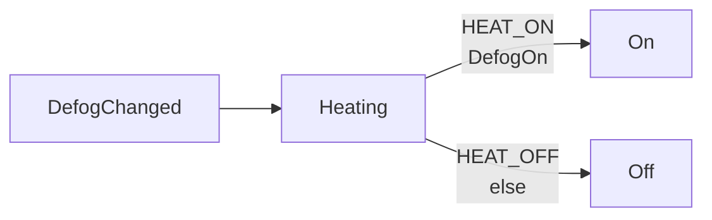
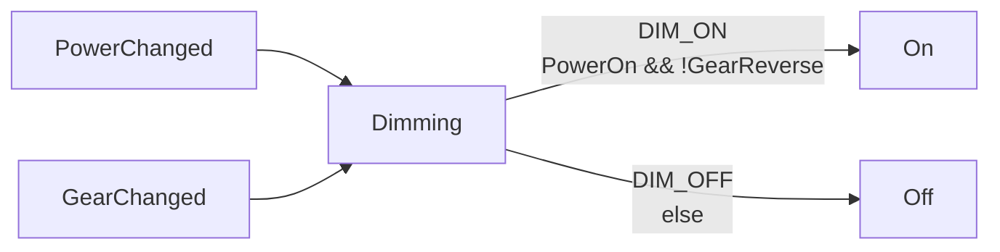
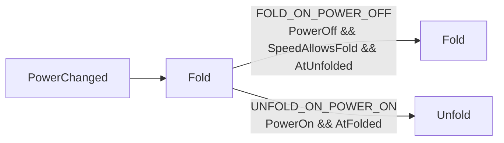

# Mirrors controller

What this controller reacts to and what it does about it. Generated from the
declarations, so it cannot drift from the code — regenerate with
`cargo run --example mirrors`.

## Features

One per file. `handles` and `emits` are read off the rules below, so a feature
cannot react to or emit anything this table omits.

| feature | handles | emits |
|---|---|---|
| `Heating` | `DefogChanged` | `On`, `Off` |
| `Dimming` | `PowerChanged`, `GearChanged` | `On`, `Off` |
| `Fold` | `PowerChanged`, `SpeedChanged` | `Fold`, `Unfold` |

## Rules

One line per `input -> output` rule. Within a feature the order is priority: the
first rule whose guard holds is the one that runs, so a rule with no guard is a
fallback.

| feature | rule | when | guard | emits |
|---|---|---|---|---|
| `Heating` | `HEAT_ON` | `DefogChanged` | `DefogOn` | `On` |
| `Heating` | `HEAT_OFF` | `DefogChanged` | else | `Off` |
| `Dimming` | `DIM_ON` | `PowerChanged`, `GearChanged` | `PowerOn && !GearReverse` | `On` |
| `Dimming` | `DIM_OFF` | `PowerChanged`, `GearChanged` | else | `Off` |
| `Fold` | `FOLD_ON_POWER_OFF` | `PowerChanged` | `PowerOff && SpeedAllowsFold && AtUnfolded` | `Fold` |
| `Fold` | `UNFOLD_ON_POWER_ON` | `PowerChanged` | `PowerOn && AtFolded` | `Unfold` |
| `Fold` | `UNFOLD_ON_SPEED` | `SpeedChanged` | `SpeedForcesUnfold && AtFolded` | `Unfold` |

## By feature

Each feature, split by the set of events its rules react to. Rules triggered by
the same combination share a table and a diagram, so what a feature does on
each trigger reads in one place.

### Heating

#### When `DefogChanged`

| rule | guard | emits |
|---|---|---|
| `HEAT_ON` | `DefogOn` | `On` |
| `HEAT_OFF` | else | `Off` |

### Dimming

#### When `PowerChanged`, `GearChanged`

| rule | guard | emits |
|---|---|---|
| `DIM_ON` | `PowerOn && !GearReverse` | `On` |
| `DIM_OFF` | else | `Off` |

### Fold

#### When `PowerChanged`

| rule | guard | emits |
|---|---|---|
| `FOLD_ON_POWER_OFF` | `PowerOff && SpeedAllowsFold && AtUnfolded` | `Fold` |
| `UNFOLD_ON_POWER_ON` | `PowerOn && AtFolded` | `Unfold` |

#### When `SpeedChanged`

| rule | guard | emits |
|---|---|---|
| `UNFOLD_ON_SPEED` | `SpeedForcesUnfold && AtFolded` | `Unfold` |

## Checks

| Check | Result |
|---|---|
| Events nothing handles | [FoldPositionChanged, UserChanged] |
| Guard names used by two node types | [] |
| Rule ids used twice | [] |
